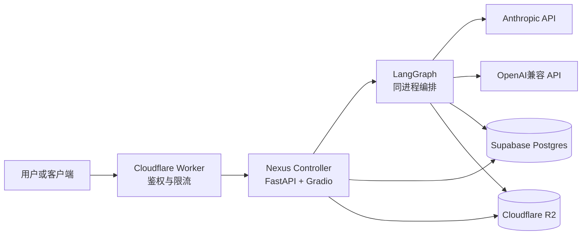
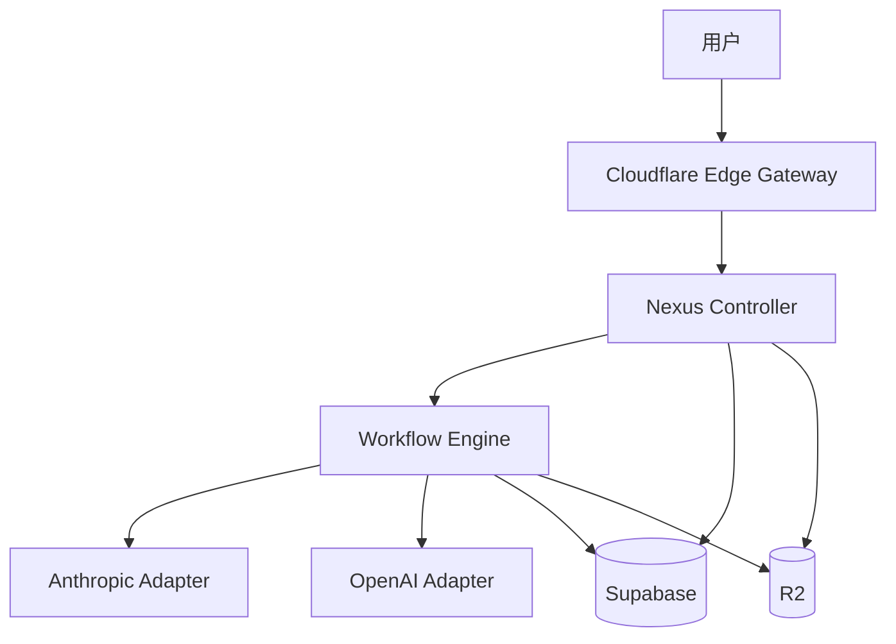
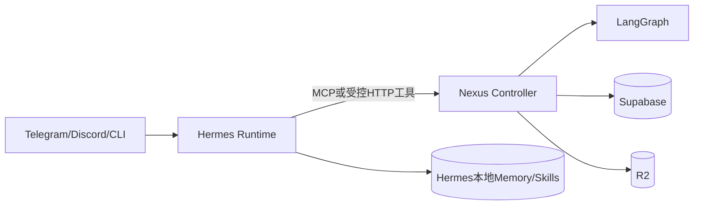
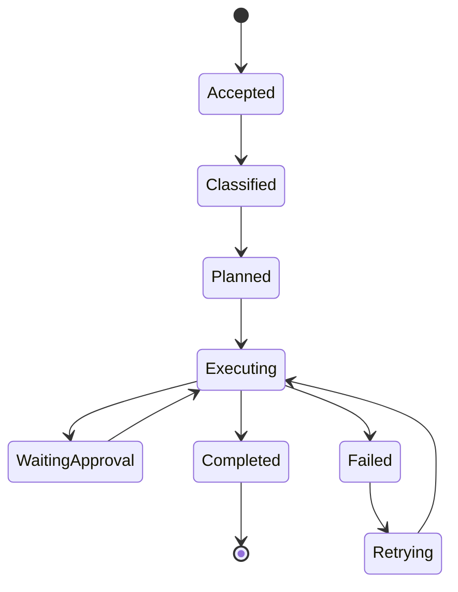
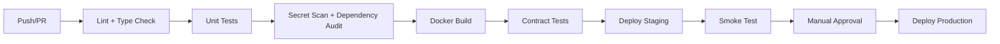

# **Nexus（星枢）混合 Agent 系统完整接手手册**

> **文档版本**：v2.1  
> **核查日期**：2026-07-27  
> **适用阶段**：架构设计完成、部署模板待实机验证  
> **文档目标**：任何人或 AI 在没有历史对话、没有额外说明的情况下，仅阅读本文即可理解 Nexus 的目标、真实边界、部署步骤、接口契约、数据模型、运维方式和后续开发路径。  
> **冲突处理**：本文与 `humes.txt`、《Nexus AI系统低成本部署方案.docx》、旧版 `HANDBOOK.md` 冲突时，以本文为准。

---

## **0. 先读结论**

Nexus 是一个低成本、外置持久化的混合 Agent 系统。系统以 FastAPI 主控接收请求，使用 LangGraph 编排复杂工作流，通过外部模型 API 完成推理和代码生成，以 Cloudflare R2 保存大对象，以 Supabase Postgres 保存结构化状态，并使用 Cloudflare Worker 提供统一网关、鉴权和健康探测。

原方案的基本方向成立，但存在三个必须纠正的架构前提：

1. **不能再把“四个免费 HF Docker Space”视为可行基础。** Hugging Face 当前官方规则要求个人 PRO 或组织付费套餐才能创建运行计算资源的 Gradio/Docker Space；免费个人账号仅有受限的 ZeroGPU Gradio 例外。因此，标准方案至少需要一个 HF PRO 账号，或者迁移至其他容器平台。[Hugging Face](https://huggingface.co/docs/hub/spaces-overview)
2. **当前代码里的 `hermes` 只是 Nexus 自建主控服务，不等于 NousResearch Hermes Agent。** 官方 Hermes 是 CLI/TUI Agent；消息 `gateway` 不是 HTTP 应用服务器，也不存在 `hermes gateway start --port 7860`。如果要真正使用 Hermes 的 Skills、Memory、Cron 和 Gateway，必须增加正式的 Hermes Runtime 适配层。[Hermes Agent](https://hermes-agent.nousresearch.com/docs/zh-Hans/reference/cli-commands)
3. **`claude-code` 与 `codex` Space 当前只是 API 适配器，不是完整的 Claude Code/Codex CLI 运行环境。** 如果它们只调用模型 API，应改名为 `anthropic-adapter` 与 `openai-adapter`，避免概念混淆；如果确实要运行 CLI，则需另行实现工作区、进程、权限、超时和沙箱管理。

因此，Nexus v2.1 推荐采用“两阶段架构”：

- **第一阶段**：单主控 Space 内嵌 LangGraph，外部调用 Anthropic/OpenAI 兼容 API，先跑通闭环。
- **第二阶段**：当有真实隔离需求时，再拆分为主控、编排和模型适配器多个 Space；需要官方 Hermes 能力时，再加入 Hermes Runtime。

---

# **1. 文档可信度与事实边界**

## **1.1 已确认的事实**

以下事实来自官方文档或官方 API 参考：

| 事实 | 确认结果 |
|---|---|
| HF CPU Basic 默认规格 | 2 vCPU、16GB RAM、50GB 非持久磁盘 |
| HF 出站网络 | 允许标准 80、443、8080 端口 |
| HF Gradio/Docker 创建条件 | 运行计算资源的 Space 需要 PRO/Team/Enterprise；免费账号仅有 ZeroGPU Gradio 例外 |
| HF Docker 数据持久化 | 容器重启后本地写入会丢失，可使用 Storage Bucket、Dataset 或外部存储 |
| R2 免费额度 | 10GB-month、每月 100 万 Class A、1000 万 Class B；互联网出口免费 |
| Workers 免费限额 | 每日 10 万请求、每次 10ms CPU、每账号 5 个 Cron Trigger |
| Hermes gateway | 消息平台网关，不是通用 HTTP 任务服务器 |
| Hermes HTTP 管理台 | `hermes dashboard`，默认本地端口 9119，需要 Web extra |
| LangGraph Postgres Checkpoint | 支持 `AsyncPostgresSaver.from_conn_string()`，首次需执行 `setup()` |
| 私有 HF Space | 对无权限外部访问返回 404，跨 Space 调用需 HF 鉴权 |

参考：[Hugging Face Spaces](https://huggingface.co/docs/hub/spaces-overview) [Hugging Face Docker Spaces](https://huggingface.co/docs/hub/spaces-sdks-docker) [Cloudflare R2](https://developers.cloudflare.com/r2/pricing) [Cloudflare Workers](https://developers.cloudflare.com/workers/platform/limits) [Hermes Agent](https://hermes-agent.nousresearch.com/docs/zh-Hans/reference/cli-commands) [LangGraph Reference](https://reference.langchain.com/python/langgraph.checkpoint.postgres/aio/AsyncPostgresSaver)

## **1.2 尚未通过实机验证的内容**

以下内容只能标记为“设计目标”或“模板声明”，不得宣称已经可用：

- 四个 Space 是否均已成功构建和启动；
- `31 个 Python 文件全部编译通过`；
- Worker 是否已完成 `tsc --noEmit`；
- `sync-spaces.sh` 是否校验完全一致；
- R2 与 Supabase 是否已用真实凭证连通；
- 端到端 `/run` 是否已经返回真实模型结果；
- 50 并发、平均响应小于 2 秒的性能指标；
- HermesFace/HuggingMes 的具体代码是否已按当前版本审计并移植；
- Supabase 免费项目暂停策略和所有配额是否仍与历史说法完全一致。

在没有 CI 日志、部署 URL、提交哈希、测试报告和平台控制台证据前，本文统一把项目状态定义为：

> **架构与模板阶段；尚未完成生产级实机验收。**

---

# **2. 系统目标与非目标**

## **2.1 系统目标**

Nexus 解决五个问题：

1. 以低固定成本托管轻量 Agent 控制平面；
2. 将复杂工作流从聊天模型中抽离，交给 LangGraph 可控编排；
3. 将模型推理外包给 API，避免本地托管大模型；
4. 将持久状态与短生命周期计算彻底分离；
5. 提供统一鉴权、任务状态、日志、备份、恢复和可视化管理。

## **2.2 当前非目标**

v2.1 不承诺：

- 高并发生产 SLA；
- 多租户计费与资源隔离；
- 完整企业审计和合规认证；
- 在 HF CPU Basic 上运行本地大模型；
- 把 R2 当关系数据库使用；
- 把 Supabase 当大文件仓库使用；
- 通过固定频率探测规避平台规则；
- 在未实现沙箱前执行任意用户 shell 命令；
- 自动把任意聊天内容安全地转化为可执行 Skill。

---

# **3. 概念命名修正**

旧版文档最严重的问题之一是组件名称与实际能力不一致。v2.1 采用以下命名：

| 推荐名称 | 旧名称 | 实际职责 |
|---|---|---|
| `nexus-controller` | `hermes-main` | Nexus 自建 FastAPI 主控、路由、Dashboard |
| `hermes-runtime` | 混入 `hermes-main` | 可选：真实 NousResearch Hermes CLI/TUI、Skills、Memory、Cron、消息 Gateway |
| `workflow-engine` | `langgraph-core` | LangGraph 工作流与 Checkpoint |
| `anthropic-adapter` | `claude-code-special` | 调 Anthropic Messages API；不是 Claude Code CLI |
| `openai-adapter` | `codex-special` | 调 OpenAI 兼容 API；不是 Codex CLI |
| `edge-gateway` | Worker Gateway | Cloudflare Worker 鉴权、转发、健康探测 |

只有实际安装并运行 Claude Code CLI，组件才可命名为 `claude-code-runtime`；只有实际安装 Codex CLI/SDK 并运行其工作流，才可命名为 `codex-runtime`。

---

# **4. 推荐架构**

## **4.1 第一阶段：单 Space 最小可行架构**

这是优先方案。



全部轻量 Python 服务运行在一个 HF Docker Space 内。LangGraph 作为 Python 库被主控直接调用；Anthropic/OpenAI 通过 HTTPS API 调用，无需分别建立转发 Space。

优势是部署、鉴权、监控和排错最简单，也避免多次跨 Space 网络跳转。2 vCPU/16GB 对不运行本地模型的轻量控制面通常足够，但实际容量必须压测后确认。

## **4.2 第二阶段：拆分式架构**

只有出现以下需求时才拆分：

- LangGraph 依赖与主控依赖冲突；
- 各组件需要独立发布或故障隔离；
- 不同模型适配器有不同安全边界；
- 需要按组件独立扩容；
- 主控需保持轻量，而工作流会长时间运行。



## **4.3 可选 Hermes Runtime**

如果要使用官方 Hermes 能力，建议将其定位为独立运行时，而非 Nexus HTTP 主控：



推荐两种接法：

- **Hermes 调 Nexus**：把 Nexus `/run` 封装成 Hermes MCP Tool 或 Skill；
- **Nexus 调 Hermes**：通过受控子进程执行 `hermes -z "prompt"`，捕获纯文本结果。

不建议直接开放 `hermes dashboard --insecure` 作为公共任务 API。

---

# **5. 仓库结构**

```text
nexus/
├── README.md
├── AGENTS.md
├── .env.example
├── .gitignore
├── pyproject.toml
├── docs/
│   ├── HANDBOOK.md
│   ├── ARCHITECTURE.md
│   ├── API.md
│   ├── DEPLOYMENT.md
│   ├── OPERATIONS.md
│   ├── SECURITY.md
│   └── ADR/
│       ├── 0001-single-space-first.md
│       ├── 0002-r2-plus-postgres.md
│       └── 0003-hermes-runtime-boundary.md
├── apps/
│   ├── controller/
│   │   ├── app/main.py
│   │   ├── app/api.py
│   │   ├── app/dashboard.py
│   │   ├── app/router.py
│   │   ├── Dockerfile
│   │   └── README.md
│   ├── workflow/
│   │   └── app/graph.py
│   └── hermes-runtime/
│       └── README.md
├── libs/
│   ├── storage/
│   │   ├── r2.py
│   │   ├── postgres.py
│   │   └── models.py
│   ├── gateway/
│   │   └── client.py
│   ├── auth/
│   │   └── bearer.py
│   └── observability/
│       └── logging.py
├── workers/gateway/
│   ├── src/index.ts
│   ├── wrangler.toml
│   └── package.json
├── sql/
│   ├── 00_schema.sql
│   ├── 01_rls.sql
│   └── 02_pgvector.sql
├── scripts/
│   ├── backup_to_r2.py
│   ├── restore_from_r2.py
│   ├── smoke_test.py
│   └── verify_env.py
└── tests/
    ├── unit/
    ├── integration/
    └── contract/
```

若后续拆分多个 Space，可增加 `spaces/controller`、`spaces/workflow`、`spaces/anthropic-adapter` 和 `spaces/openai-adapter`。不再复制 `libs/` 作为长期方案；建议把共享代码制作为内部 Python 包，或在单仓库构建上下文中直接安装。复制脚本可作为过渡，但容易产生版本漂移。

---

# **6. 组件职责**

## **6.1 Nexus Controller**

主控负责：

- 暴露 `/health`、`/ready`、`/run`、`/tasks/{id}`；
- 认证和请求校验；
- 任务路由；
- 幂等键处理；
- 创建任务记录；
- 调用 LangGraph；
- 返回同步结果或异步任务 ID；
- 提供只读运维 Dashboard；
- 管理 R2 产物的预签名 URL。

主控不负责：

- 直接运行本地大模型；
- 在请求线程内执行无限时长任务；
- 保存大型二进制内容到 Postgres；
- 以 service role key 接受任意客户端数据库查询。

## **6.2 Workflow Engine**

LangGraph 负责：

- 将任务拆为可恢复节点；
- 为每个线程保存 Checkpoint；
- 控制重试、分支、超时和人工审批；
- 调用模型适配器；
- 将大型节点产物写 R2，只在状态里存引用。

工作流节点建议：



## **6.3 模型适配器**

模型适配层只完成：

- 统一请求/响应格式；
- 模型白名单；
- 超时与有限重试；
- Token/成本统计；
- 错误标准化；
- 敏感配置隔离。

若单 Space 阶段没有安全隔离需求，适配器应是进程内 Python 模块，不必独立部署。

## **6.4 Edge Gateway**

Worker 负责：

- 校验外部 `NEXUS_API_KEY`；
- 只允许白名单路径与目标；
- 添加 request ID；
- 做轻量限流或请求大小检查；
- 转发到 Controller；
- 提供 `/health`；
- 可选健康探测。

Worker 不应代理大文件上传下载；大文件应由 Controller 生成 R2 预签名 URL，让客户端直传或直读，否则会浪费 Worker 请求和 CPU 配额。

---

# **7. API 契约**

## **7.1 认证**

```http
Authorization: Bearer <NEXUS_API_KEY>
Content-Type: application/json
X-Request-ID: <optional-uuid>
Idempotency-Key: <optional-client-key>
```

所有非健康检查接口默认拒绝无认证访问。**禁止沿用旧模板中“未配置 `NEXUS_API_KEY` 就放行”的行为**；生产和测试环境都应 fail closed。

## **7.2 健康接口**

`GET /health` 仅表示进程活着：

```json
{
  "status": "ok",
  "service": "nexus-controller",
  "version": "2.1.0"
}
```

`GET /ready` 检查依赖是否可用：

```json
{
  "status": "ready",
  "dependencies": {
    "postgres": "ok",
    "r2": "ok"
  }
}
```

健康接口不得执行高成本数据库全表查询或模型调用。

## **7.3 创建任务**

`POST /v1/tasks`

```json
{
  "prompt": "分析该仓库并生成三步重构计划",
  "mode": "auto",
  "thread_id": "optional-existing-thread",
  "attachments": [
    {
      "r2_key": "artifacts/user-123/input/repo.zip",
      "sha256": "..."
    }
  ],
  "constraints": {
    "max_steps": 10,
    "max_cost_usd": 1.0,
    "requires_approval": true
  }
}
```

返回：

```json
{
  "task_id": "uuid",
  "thread_id": "uuid",
  "status": "queued",
  "selected_route": "workflow"
}
```

## **7.4 查询任务**

`GET /v1/tasks/{task_id}`

```json
{
  "task_id": "uuid",
  "status": "completed",
  "route": "workflow",
  "result": {
    "summary": "三步计划已生成",
    "artifact_keys": ["artifacts/.../plan.md"]
  },
  "usage": {
    "input_tokens": 1200,
    "output_tokens": 800,
    "estimated_cost_usd": 0.04
  },
  "created_at": "...",
  "updated_at": "..."
}
```

## **7.5 错误格式**

```json
{
  "error": {
    "code": "UPSTREAM_TIMEOUT",
    "message": "模型服务在允许时间内未返回",
    "retryable": true,
    "request_id": "uuid"
  }
}
```

标准错误码至少包括：`UNAUTHORIZED`、`INVALID_REQUEST`、`TASK_NOT_FOUND`、`DEPENDENCY_UNAVAILABLE`、`UPSTREAM_TIMEOUT`、`UPSTREAM_RATE_LIMITED`、`BUDGET_EXCEEDED`、`INTERNAL_ERROR`。

---

# **8. 路由策略**

旧版依靠中文关键词硬路由，可用于原型，但不足以作为长期策略。推荐三层路由：

1. **显式覆盖**：客户端传 `mode` 或管理员指定目标；
2. **确定性规则**：简单、便宜、可测试；
3. **轻量分类器**：只有规则无法确定时才调用便宜模型。

建议路由类别：

| 路由 | 使用条件 |
|---|---|
| `direct` | 简单问答、无需工具或状态机 |
| `workflow` | 多步骤、审批、恢复、并行、长任务 |
| `code-strong` | 仓库级重构、复杂调试、长上下文 |
| `code-fast` | 片段补全、格式转换、简单测试 |
| `human-review` | 删除、发布、付费、凭证、外部副作用 |

路由决策必须写入 `task_events`，记录规则版本和理由，便于回放和审计。

---

# **9. 存储设计**

## **9.1 存储分层**

| 存储 | 保存内容 | 不应保存 |
|---|---|---|
| Supabase Postgres | 任务、线程、状态、事件、元数据、短 JSON | 大文件、完整仓库、图片、模型缓存 |
| Cloudflare R2 | 产物、附件、快照、Skill 归档、大型 Checkpoint blob | 高频关系查询 |
| LangGraph Postgres 表 | Graph Checkpoint 和节点写入 | 任意业务大对象 |
| HF Dataset/Bucket | 可选低频辅助或公开样例 | 关键唯一副本、高频跨账号同步 |
| Space 本地磁盘 | 临时缓存 | 唯一持久副本 |

## **9.2 R2 桶规划**

免费额度按账号聚合，没有必要为了逻辑分类创建大量桶。推荐只建三个桶：

| 桶 | 用途 |
|---|---|
| `nexus-artifacts` | 用户输入、报告、代码包、模型产物 |
| `nexus-backups` | 数据库导出、配置快照、Hermes Skills/Memory 备份 |
| `nexus-checkpoints` | 超出数据库合理大小的 Checkpoint blob |

使用前缀继续分类：

```text
artifacts/{tenant_id}/{task_id}/...
backups/postgres/{date}/...
backups/hermes/{profile}/{date}/...
checkpoints/{thread_id}/{checkpoint_id}.json.zst
tmp/{request_id}/...
```

R2 保持私有。下载和上传使用短时预签名 URL。临时前缀设置生命周期清理。

## **9.3 Supabase 表结构**

```sql
create extension if not exists pgcrypto;

create table if not exists tasks (
  id uuid primary key default gen_random_uuid(),
  thread_id uuid not null,
  status text not null check (
    status in ('queued','running','waiting_approval','completed','failed','cancelled')
  ),
  route text not null,
  prompt text not null,
  constraints jsonb not null default '{}'::jsonb,
  result jsonb,
  error jsonb,
  idempotency_key text unique,
  created_at timestamptz not null default now(),
  updated_at timestamptz not null default now()
);

create table if not exists task_events (
  id bigint generated always as identity primary key,
  task_id uuid not null references tasks(id) on delete cascade,
  event_type text not null,
  source text not null,
  payload jsonb not null default '{}'::jsonb,
  created_at timestamptz not null default now()
);

create table if not exists memories (
  id uuid primary key default gen_random_uuid(),
  scope text not null,
  memory_key text not null,
  value jsonb not null,
  version integer not null default 1,
  created_at timestamptz not null default now(),
  updated_at timestamptz not null default now(),
  unique(scope, memory_key)
);

create table if not exists artifacts (
  id uuid primary key default gen_random_uuid(),
  task_id uuid references tasks(id) on delete set null,
  bucket text not null,
  object_key text not null,
  content_type text,
  size_bytes bigint,
  sha256 text,
  created_at timestamptz not null default now(),
  unique(bucket, object_key)
);

create table if not exists model_usage (
  id bigint generated always as identity primary key,
  task_id uuid references tasks(id) on delete set null,
  provider text not null,
  model text not null,
  input_tokens bigint,
  output_tokens bigint,
  estimated_cost_usd numeric(12,6),
  latency_ms integer,
  created_at timestamptz not null default now()
);

create index if not exists idx_tasks_thread on tasks(thread_id);
create index if not exists idx_tasks_status_created on tasks(status, created_at);
create index if not exists idx_events_task_created on task_events(task_id, created_at);
```

LangGraph 自己维护的 `checkpoints`、`checkpoint_blobs` 和 `checkpoint_writes` 不要和业务 `tasks` 表混为一体。

## **9.4 RLS 与服务密钥**

- 浏览器和 Gradio 前端不得获得 `SUPABASE_SERVICE_ROLE_KEY`；
- service role 只存在服务端 Secret；
- 所有浏览器操作先到 Controller，再由 Controller 访问数据库；
- 如未来开放客户端直连，必须按用户/租户设计 RLS，而不是直接复用服务端表；
- 备份恢复脚本使用独立最小权限凭证更稳妥。

---

# **10. LangGraph 持久化**

参考调用方式：

```python
from langgraph.checkpoint.postgres.aio import AsyncPostgresSaver

async with AsyncPostgresSaver.from_conn_string(db_uri) as checkpointer:
    await checkpointer.setup()  # 首次迁移执行；生产应放到部署迁移阶段
    graph = builder.compile(checkpointer=checkpointer)

    result = await graph.ainvoke(
        {"messages": [{"role": "user", "content": prompt}]},
        config={"configurable": {"thread_id": thread_id}},
    )
```

关键修正：

- `setup()` 不应在每个业务请求中重复运行，最好在部署迁移或受控启动阶段执行；
- 不应笼统规定 Supabase 一定使用 `6543`。实际端口和连接模式应以项目 Dashboard 当前给出的连接字符串为准；
- 对长生命周期异步连接，需确认使用的 pooler 模式与驱动兼容；
- URI 密码要 URL 编码；
- 连接必须启用 SSL；
- 数据库不可达时，任务应进入可重试失败状态，而不是静默丢失 Checkpoint。

---

# **11. Hermes Runtime 集成**

## **11.1 Hermes 能力边界**

官方命令已确认包括：

- `hermes chat`、`hermes -z`；
- `hermes skills browse/search/install/list/update`；
- `hermes cron create/list/edit/pause/resume/run/remove/status`；
- `hermes gateway run/start/stop/status/setup`；
- `hermes mcp serve/add/list/test`；
- `hermes profile create/use/export/import`；
- `hermes backup`、`hermes import`；
- `hermes checkpoints`；
- `hermes dashboard`。

`AGENTS.md`、`SOUL.md`、`MEMORY.md` 和 Skills 会参与规则、人格、记忆和流程复用。旧材料中的 `/learn`、`/goal` 等命令不能在未核查当前官方版本前写进正式运行手册。[Hermes Agent](https://hermes-agent.nousresearch.com/docs/zh-Hans/reference/cli-commands)

## **11.2 推荐集成方式**

第一选择：Hermes 作为上游交互 Agent，Nexus 作为其工具。

```text
用户 → Hermes（CLI/Telegram/Discord）
     → Nexus MCP Tool / HTTP Skill
     → LangGraph
     → 模型 API、R2、Supabase
```

第二选择：Nexus 在受控任务中调用 Hermes：

```bash
hermes -z "根据指定输入执行任务"
```

子进程执行必须：

- 设置最大运行时间；
- 限制工作目录；
- 使用非 root 用户；
- 禁止默认 `--yolo`；
- 明确 toolset；
- 捕获 stdout/stderr；
- 清理临时目录；
- 记录 Hermes 版本与 profile；
- 对高风险写操作要求审批。

## **11.3 Hermes 数据备份**

官方 Hermes 自带 `hermes backup` 与 profile export。建议每天生成归档后上传 R2：

```text
hermes backup --quick -o /tmp/hermes-state.zip
→ 上传 nexus-backups/backups/hermes/default/YYYY-MM-DD/...
→ 记录 sha256 与版本
```

这比尝试同步整个 Hermes 主目录更安全，也避免复制 SQLite WAL/临时文件。

---

# **12. Cloudflare Worker 设计**

## **12.1 推荐 Worker**

```typescript
interface Env {
  NEXUS_API_KEY: string;
  CONTROLLER_URL: string;
  HF_TOKEN?: string;
}

function bearer(req: Request): string {
  return req.headers.get("Authorization") || "";
}

export default {
  async fetch(req: Request, env: Env): Promise<Response> {
    const url = new URL(req.url);

    if (url.pathname === "/health" && req.method === "GET") {
      return Response.json({ status: "ok", service: "nexus-edge-gateway" });
    }

    if (bearer(req) !== `Bearer ${env.NEXUS_API_KEY}`) {
      return Response.json(
        { error: { code: "UNAUTHORIZED", message: "Unauthorized" } },
        { status: 401 }
      );
    }

    const allowed = new Set([
      "POST /v1/tasks",
      "GET /v1/tasks",
      "GET /ready"
    ]);

    const routeKey = `${req.method} ${
      url.pathname.startsWith("/v1/tasks/") ? "/v1/tasks" : url.pathname
    }`;

    if (!allowed.has(routeKey)) {
      return new Response("Not found", { status: 404 });
    }

    const headers = new Headers(req.headers);
    headers.set("X-Forwarded-By", "nexus-edge-gateway");
    if (env.HF_TOKEN) {
      headers.set("Authorization", `Bearer ${env.HF_TOKEN}`);
      headers.set("X-Nexus-Authorization", `Bearer ${env.NEXUS_API_KEY}`);
    }

    return fetch(`${env.CONTROLLER_URL}${url.pathname}${url.search}`, {
      method: req.method,
      headers,
      body: req.method === "GET" ? undefined : req.body,
      redirect: "manual",
      signal: AbortSignal.timeout(90_000)
    });
  },

  async scheduled(
    _event: ScheduledEvent,
    env: Env,
    ctx: ExecutionContext
  ): Promise<void> {
    ctx.waitUntil(
      fetch(`${env.CONTROLLER_URL}/health`, {
        headers: env.HF_TOKEN
          ? { Authorization: `Bearer ${env.HF_TOKEN}` }
          : {}
      })
    );
  }
};
```

注意：私有 HF Space 的 HF Bearer Token 与 Nexus 内部 Bearer Token 可能冲突。更稳妥的做法是：

- Worker 对外校验 `NEXUS_API_KEY`；
- Worker 转发到 HF 时使用 `Authorization: Bearer <HF_TOKEN>`；
- Nexus 内部凭证放在 `X-Nexus-Authorization`；
- Controller 验证该内部 Header；
- 或把 Space 设为 Protected，源代码私有而应用公开，再只用 Nexus 鉴权。

## **12.2 Worker 不负责的事项**

- 不执行模型推理；
- 不拉取大对象；
- 不做数据库备份；
- 不使用 `setInterval`；
- 不把任意请求路径转发到任意 URL，防止 SSRF；
- 不记录 API Key、HF Token 或完整 prompt。

---

# **13. Docker 与 HF Space**

## **13.1 Dockerfile**

```dockerfile
FROM python:3.11-slim

ENV PYTHONDONTWRITEBYTECODE=1 \
    PYTHONUNBUFFERED=1 \
    PIP_NO_CACHE_DIR=1

RUN useradd --create-home --uid 1000 appuser

WORKDIR /app

COPY requirements.txt .
RUN pip install --no-cache-dir -r requirements.txt

COPY --chown=appuser:appuser . .

USER appuser

EXPOSE 7860

CMD ["uvicorn", "app.main:app", "--host", "0.0.0.0", "--port", "7860"]
```

不要在最终镜像中保留编译工具、密钥或不必要的 Node.js。只有真正运行 Claude Code CLI 时才安装 Node。

## **13.2 Space README frontmatter**

```yaml
---
title: Nexus Controller
sdk: docker
app_port: 7860
pinned: false
---
```

## **13.3 FastAPI 与 Gradio 共存**

推荐把 API 保留在 `/api` 或 `/v1`，Dashboard 挂到 `/dashboard`，不要让 Gradio 占据根路径导致 API 文档和健康检查混乱：

```python
import gradio as gr
from fastapi import FastAPI

app = FastAPI(title="Nexus Controller")

with gr.Blocks(title="Nexus Dashboard") as dashboard:
    gr.Markdown("# Nexus Dashboard")

app = gr.mount_gradio_app(app, dashboard, path="/dashboard")
```

## **13.4 本地磁盘**

HF Docker Space 的本地磁盘是临时的。只用于：

- 临时下载；
- 解压与转换；
- 进程级缓存；
- 待上传 R2 的中间产物。

任务结束必须清理。任何重要文件上传 R2 后应记录 SHA-256。

---

# **14. 环境变量**

## **14.1 Controller**

```dotenv
APP_ENV=production
APP_VERSION=2.1.0
NEXUS_API_KEY=
DATABASE_URL=
SUPABASE_URL=
SUPABASE_SERVICE_ROLE_KEY=
R2_ENDPOINT=
R2_ACCESS_KEY_ID=
R2_SECRET_ACCESS_KEY=
R2_REGION=auto
R2_BUCKET=nexus-artifacts
R2_BACKUPS_BUCKET=nexus-backups
R2_CHECKPOINTS_BUCKET=nexus-checkpoints
ANTHROPIC_API_KEY=
ANTHROPIC_MODEL=
OPENAI_API_KEY=
OPENAI_BASE_URL=https://api.openai.com/v1
OPENAI_MODEL=
REQUEST_TIMEOUT_SEC=90
MAX_REQUEST_BYTES=1048576
LOG_LEVEL=INFO
```

## **14.2 Worker**

```text
Secret:
NEXUS_API_KEY
HF_TOKEN（私有 Space 才需要）

Variable:
CONTROLLER_URL
```

## **14.3 Hermes Runtime**

Hermes 的 provider、模型和认证优先通过官方 `hermes model`、`hermes auth`、profile 与 `config.yaml` 管理，不要把旧版、未经核查的环境变量名直接写进镜像。

---

# **15. 备份与恢复**

## **15.1 备份目标**

| 数据 | 主存储 | 备份 |
|---|---|---|
| 业务状态 | Supabase Postgres | R2 JSON/SQL 导出 |
| LangGraph Checkpoint | Postgres | 数据库导出；大型 blob 可额外入 R2 |
| 任务产物 | R2 | 可选跨区域/第二桶复制 |
| Hermes 配置、Memory、Skills | Hermes 本地状态 | `hermes backup` 后上传 R2 |
| 源码和基础设施 | Git 仓库 | 远程私有仓库 |

## **15.2 不再采用双向自动覆盖**

旧版提出“Supabase 每 5 分钟写 R2，R2 每 10 分钟反向写回 Supabase”。这会产生循环覆盖、旧数据回写和冲突风险。

正确策略：

- 正常运行时单向备份：Supabase → R2；
- 恢复必须人工触发；
- 恢复前先创建当前快照；
- 快照带时间、schema version、row count 和 SHA-256；
- 恢复到隔离 schema 或临时表验证后再切换。

## **15.3 R2 原子发布**

R2/S3 没有传统文件系统 rename。采用：

1. 上传带唯一版本号的对象；
2. 校验 ETag/SHA-256；
3. 写一个小型 manifest 指向新版本；
4. 读端先读 manifest；
5. 保留若干历史版本供回滚。

这比“上传 tmp 后 copy 覆盖固定 Key”更可审计。

---

# **16. 安全设计**

## **16.1 强制要求**

- 所有 Secret 只放 HF Secrets、Cloudflare Secrets 或 CI Secret；
- 所有服务默认拒绝匿名调用；
- R2 桶保持私有；
- 模型、目标 URL、工作流和工具都用白名单；
- 日志不记录密钥、完整 Authorization Header 或敏感附件；
- 危险动作进入 `waiting_approval`；
- 取消 Hermes `--yolo` 默认值；
- 不允许用户控制 Worker 转发目标；
- 不允许任意路径读写 R2；
- service role key 仅后端使用；
- 镜像以 UID 1000 非 root 用户运行。

## **16.2 供应链**

- Python 和 Node 依赖锁定版本及哈希；
- 定期执行 `pip-audit`、`npm audit`；
- Hermes 可运行 `hermes security audit`；
- GitHub Actions 只使用固定版本 Action；
- 镜像构建禁止将 Secret 复制进层；
- 部署记录 commit SHA、镜像 digest 和迁移版本。

## **16.3 多用户扩展**

当前单一 `NEXUS_API_KEY` 只适合个人或内部原型。多用户时必须改为：

- Supabase Auth、OIDC 或其他身份提供者；
- 每个用户/租户独立授权；
- RLS 按 tenant_id；
- 配额、审计、撤销；
- API Key 哈希保存，不存明文；
- 任务、Memory、Artifact 都带 tenant_id。

---

# **17. 可观测性与成本控制**

每个请求生成 `request_id`，每个任务生成 `task_id`，每个工作流会话生成 `thread_id`。日志使用结构化 JSON：

```json
{
  "level": "INFO",
  "service": "nexus-controller",
  "request_id": "...",
  "task_id": "...",
  "event": "model_call_completed",
  "provider": "anthropic",
  "model": "...",
  "latency_ms": 2345,
  "input_tokens": 1200,
  "output_tokens": 450
}
```

至少监控：

- 任务成功率；
- P50/P95/P99 延迟；
- 冷启动次数；
- 模型错误和限流次数；
- 每任务 Token 与估算成本；
- R2 存储量和操作数；
- 数据库大小和连接数；
- Worker 请求数；
- 等待审批任务数量；
- 重试和死信数量。

预算约束必须在任务入口和每次模型调用前检查，不能只在结束后统计。

---

# **18. 重试、幂等与异步任务**

## **18.1 重试**

仅对以下情况重试：

- 连接失败；
- 429；
- 502/503/504；
- 明确标记为临时错误的模型错误。

不重试：

- 400 参数错误；
- 401/403；
- 模型内容拒绝；
- 预算超限；
- 数据完整性冲突。

采用指数退避并增加抖动，例如 2、4、8 秒，最多 3 次。不要嵌套多层重试导致请求风暴；由最接近失败源的一层负责重试。

## **18.2 幂等**

客户端传 `Idempotency-Key`，数据库建立唯一索引。相同键重复提交时返回同一任务，不重复调用模型。

## **18.3 长任务**

不应让 Worker 或浏览器同步等待数分钟。`POST /v1/tasks` 快速返回 202，客户端轮询状态，或未来增加 SSE/WebSocket。任务执行可由：

- FastAPI 后台任务（只适合极简原型）；
- Supabase `task_queue` 轮询 worker；
- Cloudflare Queues；
- 独立任务系统。

生产化时避免把关键任务只放在进程内内存队列。

---

# **19. 测试与验收**

## **19.1 测试层级**

- 单元测试：路由、鉴权、R2 Key 校验、错误映射；
- 契约测试：Controller ↔ Workflow ↔ 模型适配器；
- 集成测试：真实 Supabase 测试项目和 R2 测试桶；
- 故障测试：数据库不可用、R2 403、模型 429、Space 冷启动；
- 恢复演练：从 R2 快照恢复到临时 schema；
- 安全测试：无认证、伪造路径、过大请求、恶意对象 Key。

## **19.2 最小验收门槛**

| 项目 | 通过条件 |
|---|---|
| 构建 | Docker 镜像构建成功，非 root 启动 |
| 健康 | `/health` 200，`/ready` 能区分依赖故障 |
| 认证 | 无凭证 401，错误凭证 401，正确凭证可调用 |
| 数据 | 创建任务后 tasks/task_events 有完整记录 |
| 工作流 | 同一 thread_id 可恢复运行 |
| 产物 | R2 上传后 SHA-256 一致，预签名 URL 到期失效 |
| 幂等 | 重复 Idempotency-Key 不产生重复模型调用 |
| 失败 | 模型超时后状态明确、可重试、不丢任务 |
| 备份 | 能从备份恢复到隔离环境并校验行数 |
| 日志 | 不出现真实密钥或 Authorization Header |

旧版“平均响应小于 2 秒”不适合作为全链路统一指标。外部模型调用通常超过该值。应分别设定：

- API 接收与入队：P95 < 1 秒；
- 健康接口：P95 < 500ms；
- 模型任务：按模型和任务类型单独定义；
- 冷启动：单独统计，不与热路径混淆。

---

# **20. 部署步骤**

## **20.1 阶段 A：本地运行**

1. 创建 Git 私有仓库；
2. 建 Python 虚拟环境；
3. 启动本地 Postgres 或 Supabase 测试项目；
4. 建 R2 测试桶；
5. 填写本地 `.env`，确认已 gitignore；
6. 执行 SQL 迁移；
7. 启动 FastAPI；
8. 跑单元和集成测试；
9. 使用真实模型 API 做一条低成本 smoke test；
10. 完成备份与恢复演练。

## **20.2 阶段 B：单 HF Space**

1. 确认账号套餐允许创建 Docker Space；
2. 创建 `nexus-controller` Docker Space；
3. 注入 Controller Secrets；
4. 推送单 Space 镜像；
5. 验证 `/health`、`/ready`；
6. 部署 Worker；
7. 将 Worker URL 作为唯一外部入口；
8. 完成端到端测试；
9. 配置告警和平台允许范围内的健康检查。

## **20.3 阶段 C：拆分服务**

仅当单 Space 出现明确瓶颈后：

1. 抽离 workflow；
2. 为 Controller ↔ Workflow 加服务认证；
3. 增加契约测试；
4. 独立部署；
5. 验证故障回退；
6. 再按需拆模型适配器。

## **20.4 阶段 D：加入 Hermes**

1. 在独立运行环境安装 Hermes；
2. 执行 `hermes setup` 或 `hermes model`；
3. 配置安全 profile；
4. 把 Nexus 注册为 MCP Tool 或 Skill；
5. 验证 `hermes -z` 脚本化调用；
6. 配置 `hermes backup` 到 R2；
7. 最后再接消息 gateway 和 Cron。

---

# **21. 成本模型**

在当前 HF 规则下，不能再宣称整套系统固定成本为 \$0。应按下式估算：

$$
C_{\text{monthly}} =
C_{\text{HF plan}}
+ C_{\text{LLM API}}
+ C_{\text{storage overage}}
+ C_{\text{database upgrade}}
+ C_{\text{monitoring}}
$$

基础设施可能为：

- HF PRO：按当前套餐价格计；
- CPU Basic：硬件小时费为免费，但创建计算 Space 需要满足付费套餐资格；
- R2：在 10GB、100万 Class A、1000万 Class B 以内通常为 \$0；
- Workers：在每日 10 万请求和其他免费限制内通常为 \$0；
- Supabase：免费额度内为 \$0；
- 模型 API：主要可变成本。

不能在文档中固定写死套餐价格和 Supabase 配额，部署前应再次查看官方控制台。HF 和 Cloudflare 的当前关键规则分别见官方文档。[Hugging Face](https://huggingface.co/docs/hub/spaces-overview) [Cloudflare R2](https://developers.cloudflare.com/r2/pricing) [Cloudflare Workers](https://developers.cloudflare.com/workers/platform/limits)

---

# **22. 运维与排障**

| 症状 | 排查顺序 |
|---|---|
| Space 构建失败 | README frontmatter → Dockerfile → requirements 锁定 → UID 1000 权限 |
| `/health` 失败 | Uvicorn 是否监听 0.0.0.0:7860 → HF 日志 → 启动命令 |
| `/ready` 失败 | 分别检查 Postgres、R2，避免笼统报“系统不可用” |
| 私有 Space 404 | Worker 是否携带 HF_TOKEN；Space 可见性是否正确 |
| 401 | 区分 HF Token 与 Nexus Token；检查 Header 转换 |
| LangGraph 无法恢复 | thread_id 是否稳定；checkpointer 是否正确编译到 graph；数据库连接是否兼容 |
| R2 403 | endpoint、access key 权限、桶名、region=auto |
| Supabase 连接异常 | 项目状态、连接串、SSL、密码 URL 编码、连接池模式 |
| 模型 404 | 模型 ID 是否由 provider 当前模型列表确认 |
| 模型 429 | 降低并发、使用退避、启用 fallback、检查预算 |
| 数据库增长过快 | 清理事件详情、压缩 Checkpoint、把大内容迁 R2 |
| Worker 超时 | 改异步任务模式，不让 Worker 等待长模型调用 |
| 重复任务 | 检查 Idempotency-Key 与数据库唯一约束 |

---

# **23. 回滚与灾难恢复**

## **23.1 代码回滚**

- 每次部署记录 Git commit SHA；
- 使用普通 revert 或回退到已知 tag；
- 不建议直接 `git push -f` 覆盖历史；
- 数据库变更使用前向兼容迁移，不依赖代码回滚自动撤销 schema。

## **23.2 数据库回滚**

1. 停止写入或进入维护模式；
2. 创建当前快照；
3. 恢复到临时 schema；
4. 校验 row count、约束和抽样数据；
5. 切换读取；
6. 最后恢复写入。

## **23.3 R2 恢复**

- 通过 manifest 选择历史版本；
- 校验 SHA-256；
- 不覆盖唯一历史对象；
- 恢复操作写入 `task_events` 或独立审计表。

## **23.4 Hermes 恢复**

停止 Hermes gateway 后使用 `hermes import` 恢复备份；恢复前再创建一个当前状态备份，避免不可逆覆盖。

---

# **24. CI/CD**

建议流水线：



最低命令建议：

```bash
ruff check .
pytest -q
python -m compileall apps libs
pip-audit
docker build -t nexus-controller:test apps/controller
npm --prefix workers/gateway ci
npm --prefix workers/gateway run typecheck
```

部署后自动检查 `/health`、`/ready` 和一条 mock 模型任务。真实模型 smoke test 应限制费用。

---

# **25. 从旧方案迁移**

## **25.1 必须删除或改写**

- 删除“4 个免费 HF Docker Space、固定 \$0”；
- 删除 `hermes gateway start --port 7860`；
- 删除 Worker 全局 `setInterval`；
- 删除未配置 API Key 时放行；
- 删除 Supabase ↔ R2 双向定时覆盖；
- 删除过期模型 ID 默认值；
- 删除“Codex 用于图像处理”等错误定位；
- 删除“Oracle 免费数据库支持 pgvector”等未经核查结论；
- 删除没有测试证据的“已完整可用”声明；
- 删除不相关、错误或仅由搜索拼接产生的参考资料。

## **25.2 保留并优化**

- R2 + Postgres 分层；
- FastAPI + Gradio 同进程；
- Worker 统一入口；
- LangGraph Postgres Checkpoint；
- 外部 API 承担重推理；
- Hermes Skills/Memory/Cron 作为可选增强；
- 原子版本化备份思想；
- 自愈、日志、健康检查；
- `AGENTS.md`、`SOUL.md`、`MEMORY.md` 的上下文分层。

---

# **26. 当前项目状态与下一步**

## **26.1 当前状态**

- 架构：已形成 v2.1 修正版；
- 文档：已完成统一接手手册；
- 代码：只能视为已有模板，未在本次对话中读取完整源码或执行测试；
- 凭证：未知；
- 部署：未知；
- 实机验证：未确认；
- 生产就绪度：未达到。

## **26.2 下一步执行顺序**

1. 决定是否采用单 Space 第一阶段；
2. 将组件重命名，消除 Hermes/Claude Code/Codex 概念混淆；
3. 核对真实仓库与本文目录差异；
4. 修正认证 fail-open；
5. 修正 Worker Token 转发冲突；
6. 引入正式 SQL migrations；
7. 本地跑通任务、Checkpoint、R2 产物；
8. 完成备份恢复；
9. 部署一个 HF Docker Space；
10. 通过实测后再考虑拆分服务；
11. 最后接入真正的 Hermes Runtime。

---

# **27. 接手检查清单**

接手者开始工作前逐项确认：

- [ ] 已阅读本文“事实边界”和“概念命名修正”
- [ ] 已确认 HF 当前套餐与 Space 创建资格
- [ ] 已确认选择单 Space 还是拆分架构
- [ ] 已确认 Controller 不冒充官方 Hermes
- [ ] 已确认模型适配器不是 Claude Code/Codex CLI
- [ ] 已创建 Supabase 测试项目并执行迁移
- [ ] 已创建 3 个私有 R2 桶及生命周期规则
- [ ] 已生成独立 Nexus API Key
- [ ] 已确认 HF Token 与 Nexus Token 的转发方案
- [ ] 已禁止无 API Key 放行
- [ ] 已配置非 root Docker 用户
- [ ] 已跑单元、契约、集成测试
- [ ] 已完成一次数据库与 Hermes 备份恢复
- [ ] 已记录首个成功部署的 commit SHA
- [ ] 已把实测结果回写本文“当前状态”

---

# **28. 权威参考**

- [Hugging Face Spaces Overview](https://huggingface.co/docs/hub/spaces-overview)
- [Hugging Face Docker Spaces](https://huggingface.co/docs/hub/spaces-sdks-docker)
- [Cloudflare R2 Pricing](https://developers.cloudflare.com/r2/pricing)
- [Cloudflare Workers Limits](https://developers.cloudflare.com/workers/platform/limits)
- [Cloudflare Workers Pricing](https://developers.cloudflare.com/workers/platform/pricing)
- [Hermes Agent CLI Reference](https://hermes-agent.nousresearch.com/docs/zh-Hans/reference/cli-commands)
- [Hermes Agent Skills](https://hermes-agent.nousresearch.com/docs/user-guide/features/skills)
- [Hermes Agent Cron](https://hermes-agent.nousresearch.com/docs/user-guide/features/cron)
- [LangGraph AsyncPostgresSaver](https://reference.langchain.com/python/langgraph.checkpoint.postgres/aio/AsyncPostgresSaver)

本文将旧材料中的想法、已实现事实和未经核查假设分开处理：保留了 R2、Postgres、LangGraph、Worker 与 Hermes 能力组合的核心价值，同时删除了免费资源、命令、端口、模型身份和完成度方面的错误断言。最终形成的 Nexus v2.1 是一套可审计、可分阶段落地的架构基线，而不是未经运行验证的“开箱即用”承诺。

*内容由 AI 生成仅供参考*