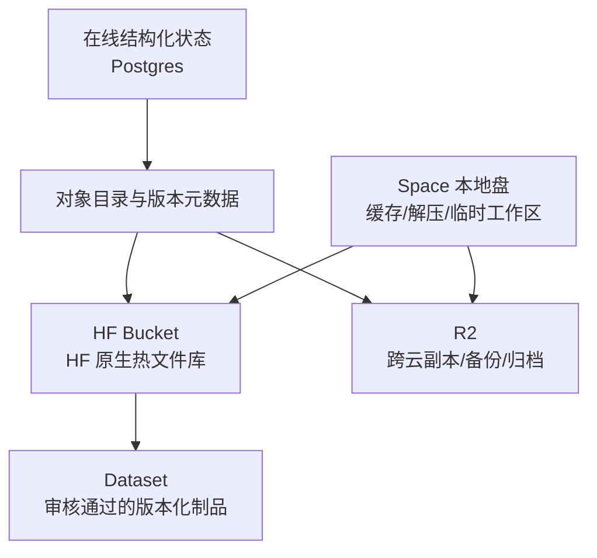
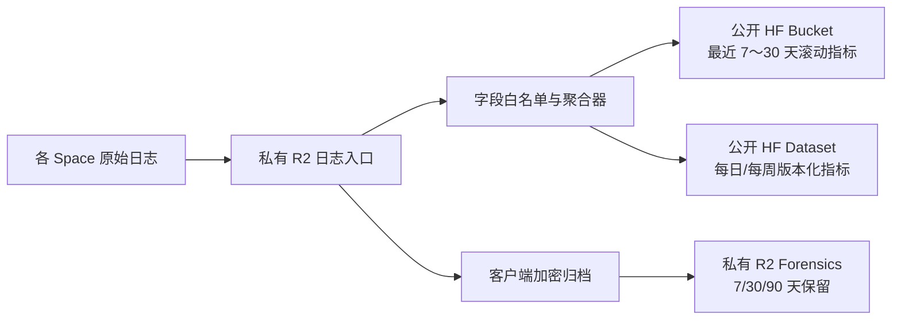
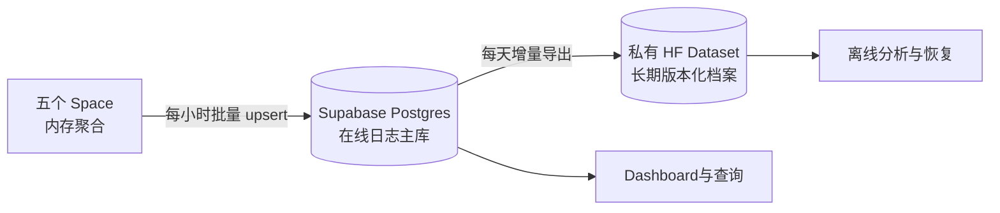

### **LangGraph 采用外部 Postgres，不是因为它“更高级”，而是因为编排状态属于需要事务、并发、查询和跨实例共享的在线结构化数据；R2、HF Bucket、Dataset 都是对象或版本仓库，不能替代数据库。**

最大收益不是把所有存储都用上，而是为每类数据指定唯一权威源：**Postgres 管“现在发生到哪一步”，R2 管跨云备份与大对象，HF Bucket 管 HF 原生可变文件，Dataset 管低频版本化知识制品，本地盘只做缓存与临时工作区。**

## **一、为什么 LangGraph 更适合外部 Postgres**

LangGraph 的 checkpoint 不是普通备份文件。每执行一个 superstep，它都可能生成：

- 当前线程状态；
- channel values；
- pending writes；
- parent checkpoint 关系；
- 中断与恢复位置；
- tool call 执行结果；
- 幂等和并发控制信息。

这些数据需要的能力是：

1. **原子提交**：checkpoint 和 writes 不能只写一半。
2. **并发控制**：多个请求可能同时推进不同 thread，甚至同一 thread。
3. **按键查询**：按 `thread_id`、checkpoint ID、namespace 检索。
4. **跨 Space 共享**：Hermes、LangGraph API 和 worker 都可能读取任务状态。
5. **低延迟小写入**：每个 graph step 都可能落一次状态。
6. **约束与索引**：唯一键、租户边界、TTL、审计查询。
7. **独立生命周期**：Space 休眠、重建或扩容不能让工作流状态消失。

Postgres 正好对应这些需求。R2、Bucket 和 Dataset 更适合“通过对象名称取整块内容”，不适合高频事务状态或条件查询。LangGraph 官方也将 Postgres checkpointer列为生产模式，并建议通过连接池管理长任务连接。 [LangChain Reference](https://reference.langchain.com/python/langgraph/checkpoints) [LangChain Support](https://support.langchain.com/articles/6253531756-understanding-checkpointers-databases-api-memory-and-ttl?ref=blog.langchain.com&threadId=c07489e6-d27d-4e1e-b86e-93e66ecd45fc)

### **是否绝对必须采用 Postgres？**

不是。应按规模判断：

| 场景 | 合理选择 |
|---|---|
| 单人实验、单进程、失败后可重跑 | SQLite |
| 单 Space、严格单写、低并发 | SQLite + Litestream |
| 多组件共享任务状态 | Postgres |
| 多用户、多租户、并发 thread | Postgres |
| 需要暂停/恢复、审批、重试、审计 | Postgres |
| 只执行无状态的一次性调用 | 不需要 checkpointer，或短期内存状态 |

> **边界警示（修正项⑧）**：Litestream **仅**复制 SQLite 的 WAL 文件，不懂也不支持 PostgreSQL、MySQL 等其他数据库的物理/逻辑日志。表中“SQLite + Litestream”行的正用前提是底层数据库为 **SQLite**（如 OmniRoute、本地短期 DB）；**Nexus 主库是 Supabase PostgreSQL，litestream 无法复制其 WAL，属技术误配**，不可把 Litestream 当作 PostgreSQL 的灾备手段。PostgreSQL 的正解见下文“灾备与备份边界”节：Supabase 自带 daily backup + PITR（Pro+ RPO 2min）/免费档 `supabase db dump` 入 R2。

Nexus 仓实装有 **Hermes、LangGraph、Claude、Codex 四个组件**（`spaces/` 四目录）；OmniRoute 为外部模型路由网关（`diegosouzapw/OmniRoute`）作 Nexus 下游模型数据面后端独立部署调用不合码（见 `docs/archive/连接-gpt5.6sol.md` "Agent→OmniRoute→Provider" 拓扑，不在 `spaces/` 内）。四组件 + 外部 OmniRoute 天然存在跨服务调用、长任务、暂停恢复和并发，因此外部 Postgres 是有实际价值的。下文凡引"五组件/omniroute"均继承自 omn 血统五空间原型原貌，应理解为四组件 + 外部 OmniRoute 下游的血统参考，非臆造 Nexus 内建五组件。

但应注意：**不是这四组件（及外部 OmniRoute）都直接读写 LangGraph 内部 checkpoint 表。**正确方式是：

- LangGraph 独占并管理 `checkpoints`、`checkpoint_blobs`、`checkpoint_writes`；
- Nexus 自己建立 `runs`、`jobs`、`artifacts`、`approvals`、`agents` 等业务表；
- 其他 Space 通过 LangGraph API 或业务表协作；
- 不直接修改 LangGraph 内部表。

## **二、四种远程存储的本质差异**

| 存储 | 本质 | 最适合 | 不适合 |
|---|---|---|---|
| **Postgres** | 事务型结构化数据库 | 任务、状态、关系、索引、权限、并发 | 大文件、Git 仓库、海量附件 |
| **R2** | 跨云 S3 对象存储 | SQLite WAL 副本、pg_dump、冷备、大工件、归档 | 高频行更新、全文关系查询 |
| **HF Bucket** | HF 原生可变对象存储 | HF Space 工作文件、资料、插件包、滚动备份 | 事务状态、需要完整 Git 历史的内容 |
| **HF Dataset** | Git/Xet 版本仓库 | 稳定、可审阅、可回滚、可发布的数据版本 | 高频变化、临时文件、日志流、每五分钟整库备份 |

HF 官方把 Bucket 定义为非版本化、可覆盖、可删除的对象存储，特别适合 agentic storage、工具输出、中间工件和 rolling backup；Dataset 则适合需要版本历史和协作发布的成品。更为关键的是二者在 **Space 挂载态的读写权限差异**——HF 官方 [manage-spaces Note](https://huggingface.co/docs/hub/en/spaces-managing-spaces) 逐字明确：

> "**Models, datasets, Spaces always mounted as read-only. Only storage buckets support read-write mounts.**"

即 **Dataset 挂入 Space 时强制只读（RO），唯有 Storage Bucket 支持 read-write（RW）挂载**。这是决定“某类文件该放 Dataset 还是 Bucket”的根本约束：凡需 Space 运行时直接写、覆盖、删除的工作文件，必须走 Bucket，挂载态 Dataset 写不动；凡仅供 Space 读取、且需版本历史与协作发布的成品才走 Dataset，写入只能通过 `git push`/`commit` 经 Hub，而非挂载写。[Hugging Face](https://huggingface.co/docs/hub/storage-buckets) [Hugging Face Blog](https://huggingface.co/blog/storage-buckets)

Cloudflare 也将 R2定位为文件和大对象存储，而非需要强一致协调和 SQL 查询的应用数据库。 [Cloudflare](https://developers.cloudflare.com/workers/platform/storage-options)

## **三、R2 与 HF Bucket 是否功能重复？**

部分重复，但两者可以承担不同责任。

### **推荐分工**

- **R2：系统级备份与跨云灾备**
  - SQLite（如 OmniRoute）WAL 的 Litestream 复制目标——仅适用 SQLite,Postgres 物理 WAL 不可;
  - Supabase PostgreSQL 的远程备份承载（正解见下):免费档 `supabase db dump` 入 R2;Pro+ 用 Supabase 自带 daily backup + PITR(RPO 2min)为主,R2 仅作离线冷备副本;
  - 不可变发布包镜像；
  - 长期审计归档；
  - HF 整体故障时仍能恢复。

- **HF Bucket：HF 集群共享文件平面**
  - Agent 生成文件；
  - Obsidian Vault；
  - 资料库原文件；
  - 技能和插件候选包；
  - 任务输出；
  - Space 启动时按需同步的工作区。

这样才能获得真正的跨故障域收益。如果同一份内容只放 HF Dataset 和 HF Bucket，它们仍处于同一平台，不能算完整跨云灾备。

### **什么时候可不使用 HF Bucket？**

如果你希望架构最简，而且：

- 所有应用都能直接访问 S3；
- 不需要 HF volume mount；
- 不需要 `hf://` 或 HF 网页浏览；
- R2 已承担所有工件和文件；

那么完全可以采用：

```text
Postgres + R2 + Dataset
```

HF Bucket 不是必需层。

### **什么时候 HF Bucket 值得加入？**

当存在以下需求时值得加入：

- Hermes、Claude、Codex 需要一个可挂载或易同步的共享工作区；
- 希望在 HF 页面直接浏览文件；
- 大量 AI 生成文件频繁增加、覆盖、删除；
- 希望利用 HF/Xet 对相似文件的块级去重；
- 需要把处理中资料与最终 Dataset 发布物分开。

## **四、建议采用“五层状态模型”**



### **第一层：Postgres——控制面与元数据权威源**

保存：

- `runs`：任务与运行状态；
- `steps`：执行步骤；
- `threads`：会话和 LangGraph thread；
- `approvals`：人工审批；
- `artifacts`：文件对象的元数据；
- `knowledge_items`：资料索引；
- `memory_items`：结构化长期记忆；
- `skills`：技能注册信息；
- `skill_versions`：版本、hash、对象地址；
- `plugin_installs`：插件安装状态；
- `leases`：单写锁和 worker 租约；
- `audit_events`：关键操作事件。

Postgres 只保存小型结构化数据和对象引用，例如：

```text
artifact_id
tenant_id
object_uri
sha256
size
mime_type
version
source
created_at
retention_class
visibility
```

不要把大型 PDF、压缩包、Git 工作区或完整 Obsidian Vault 直接塞入 Postgres。

### **第二层：R2——灾备和不可变对象权威源**

建议保存：

```text
r2://nexus-dr/
├── sqlite/
│   ├── omniroute/
│   └── hermes/
├── postgres/
│   ├── daily/
│   └── weekly/
├── releases/
│   ├── skills/
│   ├── plugins/
│   └── adapters/
├── artifacts/
├── audit/
└── manifests/
```

关键原则：

- 备份路径不可覆盖；
- 文件名带时间、版本和 SHA-256；
- 开启 bucket lifecycle；
- 写入 manifest；
- 使用独立只写/只读凭据；
- 定期从 R2 恢复，而不只是检查“上传成功”。

> **灾备与备份边界（修正项⑧，必读）**：R2 上的灾备链必须按“源数据库是什么”区分手段。
> - **SQLite（OmniRoute 及可能的 hermes 本地短期 DB）**：Litestream → R2 是正用。Litestream 逐字只懂复制 SQLite 的 WAL 文件，见 [litestream.io](https://litestream.io) 官方定义(litestream = "streaming replication for SQLite")。
> - **Supabase PostgreSQL（Nexus 主库）**：litestream **读不了 Postgres 的物理 WAL**,在 Nexus 侧是技术误配,不可作为 Postgres 灾备手段。正解为 Supabase 自带灾备链——Pro+ 档启用 daily backup + PITR(时间点恢复,RPO ≤ 2min),见 [supabase.com/docs/guides/platform/backups](https://supabase.com/docs/guides/platform/backups);免费档无 PITR,以 `supabase db dump` 定期导出入 R2 作离线冷备副本。
> 文件凡引“Litestream”作 PostgreSQL 灾备处,均应理解为 OmniRoute SQLite 正用,而 Nexus Supabase Postgres 灾备走 Supabase 原生 backup/PITR + R2 冷备副本。

### **第三层：HF Bucket——可变工作文件与共享资料**

建议保存：

```text
hf://buckets/i3t2y/nexus-workspace/
├── users/<user_id>/
│   ├── vault/
│   ├── uploads/
│   └── exports/
├── agents/<agent_id>/
│   ├── workspace/
│   ├── scratch/
│   └── generated/
├── knowledge/
│   ├── inbox/
│   ├── normalized/
│   └── attachments/
├── skills/
│   ├── candidate/
│   └── installed/
├── plugins/
│   ├── candidate/
│   └── installed/
└── jobs/<run_id>/
    ├── input/
    ├── output/
    └── logs/
```

Bucket 中的“installed”不应表示机器真的在运行时动态安装，而应表示**获准使用的发布包**。启动时只加载已验证、带 hash 和签名的包。

> **Nexus 现役对齐注（截至 commit a142da9/fe275ae/4fc098e，已落地）**：本件以上 Bucket 分工为通用原则性叙述。Nexus 现役 hermes 已落实 **Bucket RW 单挂** 方案——逻辑层（`app/scripts/libs`）从 HF Bucket 以 read-write 挂载到 `/data`，运行时可直接写 `/data`;依赖进 **GHCR base 镜像**(永不入 HF repo);`Dockerfile` 作**墓碑**(1 行 `FROM ghcr ARG` 占位);`start.sh` 走 `hf buckets sync` bootstrap 兜底拉真 Bucket(非 Dataset)。即 Nexus 现役实际形态:Bucket rw `/data` 单挂数据/工作文件 + GHCR base 承载依赖 + Dockerfile 墓碑,见 `spaces/hermes/*`。本件中凡涉及"Bucket 可选/非必需"属通用存储总论,与 Nexus 现役已单挂落地无冲突,仅作架构演进背景。

### **第四层：Dataset——版本化、审核后的知识制品**

Dataset 最适合：

- 更新频率低；
- 需要版本历史；
- 需要人工审查；
- 需要被复现或引用；
- 有明确发布批次。

> **Dataset 挂载与写入语义（修正项①③，必读）**：
> - **挂载态强制只读**：HF 官方 manage-spaces Note 逐字"Models, datasets, Spaces always mounted as read-only. Only storage buckets support read-write mounts."——Dataset 挂入 Space 后只读,Space 运行时无法直接写挂载的 Dataset 目录;改 Dataset 内容只能经 Hub 端 `git push`/`commit`。
> - **版本化回滚锚(修正项②)**：Dataset 是 Git/Xet 版本仓库,每次 push 即一次 commit;storage-buckets 对比表明确 Repo = "Full Git history" 而 Bucket = "None mutable, overwrite-in-place"。故改 Dataset 逻辑 = 1 commit = 1 不可变回退锚,可接 commit SHA / git tag 回滚;改 Bucket 逻辑 = `sync` 覆盖无锚回退。
> - **push 不触发挂载 Space rebuild（修正项③）**：HF 官方 spaces-overview 中"the Space"指 Space 自身 repo(manage-spaces 的 TaskScheduler 例旁证:Space 醒来靠显式 `request_space_hardware` 硬件请求,而非 dataset push 事件)。故向 Dataset push 不会自动重建/重挂它所挂载的 Space;Nexus 若改 Dataset 逻辑需热更,须 **git push + manual `restart_space`** 两步,不撞付费墙(不会因 dataset push 触发 Space rebuild 计费)。

适合存放：

- 稳定技能包的源定义；
- 插件 manifest 和兼容性矩阵；
- 规范化知识语料；
- 评测集；
- prompt、policy、ontology；
- 脱敏后的学习样本；
- Obsidian Vault 的周期性发布快照；
- 记忆导出和迁移包；
- 数据 schema、manifest 和索引快照。

不适合存放：

- 每次请求日志；
- 每五分钟 SQLite 整库；
- 临时工作区；
- `node_modules`；
- Python venv；
- 高频变动的 Obsidian 文件；
- 每步 LangGraph checkpoint；
- 未脱敏的用户记忆。

### **第五层：本地 ephemeral——计算缓存**

只保存可丢失、可重建内容：

- Git checkout；
- 模型或包缓存；
- 编译临时文件；
- 当前任务工作目录；
- 解压后的技能和插件；
- 查询产生的索引 shard 缓存；
- SQLite 热副本；
- 临时导出文件。

判断标准很简单：

> 这个目录被立刻删除，系统能否仅凭远程权威源恢复？

如果不能，就不应只放本地盘。

## **五、具体内容应该放在哪里**

### **技能**

技能由多个层次组成：

| 内容 | 推荐位置 |
|---|---|
| 技能名称、状态、当前版本、权限 | Postgres |
| 开发中技能文件 | HF Bucket `skills/candidate/` |
| 审核后的版本化技能源码 | Dataset |
| 签名发布包 | R2 + 可选 HF Bucket |
| 运行时解压副本 | 本地 ephemeral |
| 技能使用统计 | Postgres |
| 技能执行日志 | 私有 R2/Bucket |

推荐生命周期：

```text
Agent 生成候选技能
→ HF Bucket candidate
→ 测试和安全审查
→ 生成不可变包 + SHA-256
→ Dataset 提交版本
→ R2 保存签名制品
→ Postgres 将 active_version 指向新版本
→ worker 启动时下载到本地缓存
```

不能让 Agent 直接把自己生成的脚本写入生产技能目录并立即执行。

### **插件**

插件比技能更危险，因为可能包含依赖、进程和网络权限。

| 内容 | 推荐位置 |
|---|---|
| 插件 manifest、版本、权限声明 | Dataset + Postgres 注册表 |
| 插件压缩包/二进制 | R2 |
| 开发候选包 | HF Bucket |
| 安装状态与启用范围 | Postgres |
| 运行时文件 | 镜像或本地只读缓存 |
| Secret | HF Space Secrets/外部 Secret Manager |

插件发布包必须包含：

- SHA-256；
- 签名；
- SBOM；
- 最低/最高兼容版本；
- 权限 manifest；
- 出网域名 allowlist；
- 安装和回滚脚本；
- 数据迁移版本。

### **后续补充安装的程序**

生产中不建议把 apt、pip、npm 的“已安装目录”直接持久化。`node_modules`、venv 和系统二进制通常包含平台、ABI、权限、软链接和原生扩展，复制到 Bucket 后跨镜像恢复可能出错。

推荐优先级：

1. **成熟程序：进入 GHCR 镜像**；
2. **低频插件：制成 OCI sidecar 或签名 tar 包存 R2**；
3. **纯 Python/JS 轻插件：带 lockfile、hash，启动时安装到本地 cache**；
4. **Package Replay：仅用于开发环境，不进入生产主路径**。

> **Nexus 现役对齐（GHCR base 三件结构）**：第 1 项在 Nexus hermes 已落地为四层分离——依赖进 **GHCR base 镜像**(永不入 HF repo),逻辑层(app/scripts/libs)进 **HF Bucket** 以 rw `/data` 单挂,`Dockerfile` 作**墓碑**(1 行 `FROM ghcr ARG` 占位,ARG `BASE_IMAGE` 全局声明+`FROM ${BASE_IMAGE}`+`ARG BASE_IMAGE` 重声明+`ENV BASE_IMAGE=${BASE_IMAGE}` 转存,commit fe275ae),`start.sh` 走 `hf buckets sync` bootstrap 拉真 Bucket(commit 4fc098e,非 Dataset)。即现役免改三文件方案见 `spaces/hermes/*`。

因此，“后续安装程序”不直接把安装结果当权威源，而是保存：

```text
安装意图 + 精确版本 + lockfile + hash + 发布包
```

### **Obsidian 学习库**

Obsidian Vault 是文件树，既有高频编辑，也有历史价值。推荐采用双层：

- **HF Bucket 或 R2**：当前工作版本；
- **Dataset 或 Git repo**：周期性版本化快照。

目录示例：

```text
vault/
├── notes/
├── attachments/
├── templates/
├── canvas/
└── .obsidian/
```

需要注意：

- `.obsidian/workspace*.json` 等设备 UI 状态可不发布；
- 附件大文件放 Bucket/R2，Markdown 中保存相对路径或对象 URI；
- 每小时或每日生成一致性快照，而非每次按键提交；
- Dataset 只发布脱敏、稳定、可共享的 vault 版本；
- 私人 Vault 必须私有。

如果需要多端实时编辑或冲突合并，应以 Git/Obsidian Sync 类协议为主，而不是直接让多个 Space 同时覆盖同一个 Bucket 路径。

### **资料库**

把资料库拆成三层：

| 层 | 内容 | 位置 |
|---|---|---|
| 原始层 | PDF、网页快照、图片、音视频 | R2/HF Bucket |
| 规范化层 | Markdown、JSONL、OCR、分段文本 | HF Bucket |
| 发布层 | 去重、脱敏、质量审核后的语料版本 | Dataset |
| 索引层 | 文档元数据、权限、hash、来源 | Postgres |
| 检索层 | embedding | pgvector 或专用向量库 |

Postgres/pgvector 保存 embedding 和对象 URI；原文件仍放对象存储。不要把 PDF 直接放 LangGraph state，也不要在 checkpoint 中保存完整文档正文。

### **记忆库**

“记忆”至少分四类：

| 记忆类型 | 示例 | 推荐位置 |
|---|---|---|
| thread 短期记忆 | 当前会话和 graph state | LangGraph Postgres checkpointer |
| 用户长期事实 | 偏好、身份、稳定事实 | Postgres Store/业务表 |
| 情节记忆 | 曾完成的任务、结果摘要 | Postgres + R2 工件引用 |
| 语义资料 | 笔记、文档、知识片段 | Bucket/R2 原文 + pgvector 索引 |
| 冷归档 | 已结束会话完整转储 | R2 |
| 可迁移版本 | 脱敏后的记忆导出 | 私有 Dataset |

必须避免把所有聊天原文永久塞进 checkpointer。建议：

- checkpoint 负责“恢复执行”；
- append-only message 表负责完整会话记录；
- long-term memory 表负责提炼出的事实；
- R2 负责原始附件和冷归档；
- Dataset 只负责人工导出、迁移和版本化，不作为在线记忆查询库。

## **六、最有收益的组合方案**

### **推荐的完整方案**

```text
Postgres
  = 在线控制面、LangGraph checkpoint、长期记忆、对象目录

R2
  = 跨云灾备、SQLite WAL 副本(Litestream,仅 SQLite)、pg_dump、不可变发布包、冷归档

HF Bucket
  = HF 内部热文件库、工作区、知识 inbox、Agent 生成工件

HF Dataset
  = 经审核的稳定技能、知识版本、评测集、周期快照

本地 ephemeral
  = 热缓存、运行时解压、Git checkout、SQLite 热副本
```

### **最简高收益方案 / 何时升级为四远端存储（合并去冗）**

> 本节与第三章「三、R2 与 HF Bucket 是否功能重复」下的「什么时候可不使用 HF Bucket / 什么时候 HF Bucket 值得加入」同主题,此处不再重复论证,仅给出 Nexus 落点。

如果希望减少复杂度,起点可用:

```text
Postgres + R2 + Dataset
```

- Postgres 管在线结构化状态；
- R2 管所有文件、工件和备份（Postgres 灾备走 Supabase 原生 backup/PITR,R2 仅承接 SQLite Litestream 与 db dump 冷备副本,见第二节「灾备与备份边界」）；
- Dataset 只管公开或需要版本历史的稳定制品；
- 不引入 HF Bucket。

这通常是 Nexus 通用存储总论视角下更合理的起点。**但注意**:此处属通用演进背景;Nexus 现役 hermes 已落 a142da9 Bucket RW `/data` 单挂(见第四节「Nexus 现役对齐注」),即现役实际已引入 Bucket 单挂,不属"未引入"状态。

升级为四远端存储(在通用总论意义上)的触发痛点与第三章同,不再复述。

## **七、最重要的治理规则**

每个对象必须只存在一个“当前权威源”，其他位置明确标成副本或发布版本。例如：

```text
LangGraph checkpoint：
  权威源 = Postgres (Supabase)
  灾备 = Supabase 原生 daily backup + PITR(Pro+, RPO 2min); 免费档 supabase db dump → R2 冷备
  注 = litestream 读不了 Postgres 物理 WAL,此处不用 litestream

OmniRoute SQLite (及可能的 hermes 本地短期 DB)：
  权威源 = 本地单写 SQLite
  连续副本 = Litestream → R2 (仅 SQLite WAL 正用)
  冷备 = 每日校验快照

Obsidian Vault：
  权威源 = HF Bucket 或 R2，二选一
  版本发布 = Dataset

技能：
  开发源 = Git/Dataset
  发布包 = R2
  当前启用版本 = Postgres
  运行副本 = 本地缓存
```

不要让同一个可变文件同时以 R2、HF Bucket 和 Dataset 为三个“主库”，否则会立即出现版本冲突、恢复方向不明和覆盖问题。

最终建议是：**为 Nexus 保留外部 Postgres；将其限制在在线结构化状态和索引层。初期采用 Postgres + R2 + Dataset，HF Bucket 作为文件规模和 HF 原生协作需求成熟后的增强层。**这样不会为了“存储齐全”增加无意义复杂度，同时为技能、插件、知识库和长期记忆留出清晰的演进路径。

### **可以建立公开日志库，但只应存“从源头设计为公开”的低敏聚合数据；加密敏感日志不应放公开 Dataset 或 Bucket。公开存储也不是无限容量，只是与私有额度分开按 public storage 规则计量。**

截至 2026 年 7 月 29 日，HF 官方口径是：存储政策适用于 models、datasets、buckets 等所有 Hub 类型；免费账号公开存储为 **Best-effort**、私有存储为 **100 GB**，PRO 则是最多 **10 TB 公开 + 1 TB 私有**。官方还明确说，公开存储超过最初几 GB 后，应确保内容对社区有真实价值；大量内部运行日志并不天然满足这一条件。 [Hugging Face](https://huggingface.co/docs/hub/storage-limits)

## **公开存储与私有 100 GB 的关系**

你的理解有一半正确：

- 公开 Dataset/Bucket 不占用免费账号的 **100 GB 私有存储配额**；
- 但公开数据仍计入账号的 **public storage 使用量**；
- 免费公开存储不是硬性“无限”，而是 Best-effort；
- 平台有滥用控制，也可能要求升级、购买扩容或清理；
- PRO 的公开存储存在明确的“最多 10 TB included”口径，并可购买公开存储附加包。

所以不能把公开库设计成规避私有配额的无限归档盘。

## **建议建立几个库**

建议只建立两个日志目标，不要把所有日志混在一个公开库里：

| 存储目标 | 可见性 | 内容 | 建议载体 |
|---|---|---|---|
| `nexus-observability-public` | 公开 | 聚合指标、公开运行状态、公开基准结果 | HF Dataset |
| `nexus-audit-private` | 私有 | 脱敏后仍可能敏感的审计日志、错误上下文 | R2，必要时私有 Bucket |
| `nexus-forensics-private` | 私有 | 原始敏感日志加密包、事故证据 | 独立 R2 Bucket |

严格来说，第三个不应放在 HF 公共存储。

## **公开 Dataset 适合什么内容**

公开 Dataset 的价值在于**版本化、可查询、可复用和社区价值**。适合发布：

- 每小时或每天的可用率；
- HTTP 状态码分布；
- 延迟直方图；
- provider/model 级 token 聚合；
- 压缩率；
- 缓存命中率；
- 错误类别计数；
- 版本与兼容性矩阵；
- 脱敏后的性能基准；
- 恢复演练结果；
- 公开组件的 release、健康趋势和故障时间线。

例如：

```json
{
  "date": "2026-07-29",
  "component": "omniroute",
  "release": "sha256:...",
  "requests": 12450,
  "success_rate": 0.992,
  "p50_ms": 820,
  "p95_ms": 4210,
  "error_counts": {
    "rate_limited": 31,
    "upstream_timeout": 22
  }
}
```

应采用 Parquet 或按日合并的 JSONL，而不是每个请求一个小文件。HF 对 Git-backed repository 的建议包括：总文件数尽量低于 100,000、单目录低于 10,000、避免数千次以上的高频 commit。官方明确提醒，Git 仓库不是高频写入数据库。 [Hugging Face](https://huggingface.co/docs/hub/storage-limits)

### **合理发布频率**

- 原始指标在本地或私有对象存储中按分钟聚合；
- 每小时生成中间汇总；
- 每天向公开 Dataset 提交一次；
- 每月合并为 Parquet partition；
- 禁止每 5 分钟提交整份日志。

> **push 语义注意（修正项③）**:每天一次 `git push` 写 Dataset 是经 Hub 写入(Dataset 挂载态只读,见第四节)。**push 不会自动重建/重挂任何挂载该 Dataset 的 Space**——spaces-overview 中"the Space"指 Space 自身 repo,manage-spaces 的 Space 唤醒靠显式 `request_space_hardware` 而非 dataset 事件。故若某 Space 需消费更新后的 Dataset,热更动作须 **push + manual `restart_space`** 两步,不会因 dataset push 触发 Space rebuild 计费。

推荐结构：

```text
nexus-observability-public/
├── README.md
├── schema.json
├── daily/
│   ├── component=hermes/year=2026/month=07/part-2026-07-29.parquet
│   ├── component=langgraph/year=2026/month=07/part-2026-07-29.parquet
│   └── component=omniroute/year=2026/month=07/part-2026-07-29.parquet
├── benchmarks/
└── incidents/
```

## **公开 Bucket 适合什么内容**

HF Bucket 是非版本化、可覆盖、可删除的对象存储，更适合：

- 当前健康状态；
- 最近数天的滚动公开指标；
- 大型公开 benchmark 文件；
- 可随时清理的公开 traces；
- Dashboard 直接读取的数据文件。

它比 Dataset 更适合高频更新和 rolling retention。官方明确列出的 Bucket 用例包括日志、Agent traces、工作文件和 rolling backups。 [Hugging Face](https://huggingface.co/docs/hub/storage-buckets)

因此可以采用：

```text
公开 HF Bucket
    └── 最近 7～30 天滚动公开指标

公开 HF Dataset
    └── 每日或每周固化后的版本化公开数据
```

但如果日志量不大，只有一个公开 Dataset 就够了，不必为了“多一层存储”增加 Bucket。

## **为什么不应把加密敏感日志放公开库**

“密文看不懂”不等于“可以公开”。公开密文仍会泄露：

- 文件大小；
- 产生时间；
- 事件频率；
- 组件名称；
- 租户或任务数量变化；
- 压缩率；
- 密文版本；
- 上传模式；
- 事故发生时间。

更重要的是，一旦发生以下情况，公开内容不可召回：

- 加密密钥泄露；
- 算法或实现出现问题；
- nonce 重用；
- 错误地把 key、salt 或敏感 metadata 一并上传；
- 未来计算能力或密码学发生变化；
- 操作人员把未加密包误传到同一路径。

公开 Dataset 还有 Git 历史。即使后来删除当前文件，旧 commit 和 LFS/Xet 对象仍可能保留。HF 官方也说明，删除 Git-backed repo 中当前文件并不自动释放历史存储，清理往往需要破坏性重写历史。 [Hugging Face](https://huggingface.co/docs/hub/storage-limits)

因此：

> **敏感数据即使加密，也仍按敏感数据处理。**

加密是防线，不是公开许可。

## **敏感日志的正确去向**

推荐保存到独立私有 R2 Bucket：

```text
r2://nexus-forensics-private/
├── raw/
│   └── component/year/month/day/hour/
├── encrypted-archives/
├── manifests/
└── legal-hold/
```

采用以下控制：

1. 客户端加密后上传；
2. 每个归档使用独立数据密钥；
3. 数据密钥由主密钥封装；
4. 主密钥不存 R2，也不存 HF；
5. 使用现代 AEAD，如 AES-256-GCM 或 XChaCha20-Poly1305；
6. nonce 必须唯一；
7. manifest 记录 SHA-256、时间范围、schema、加密版本；
8. metadata 也要最小化；
9. 设置 7/30/90 天生命周期；
10. 读凭据与写凭据分离；
11. 平时服务只拥有写权限；
12. 恢复和解密通过人工审批。

如果一定要在 HF 内保存，则用**私有 Bucket**，不使用公开 Dataset；但它会计入私有额度。

## **哪些日志即使脱敏也不应公开**

以下内容默认必须私有：

- prompt 和 response；
- Agent 推理或完整轨迹；
- 工具参数与输出；
- 代码、diff、文件路径；
- 用户输入和上传文件名；
- account/user/thread/run ID；
- IP、User-Agent、Referer；
- Authorization、Cookie 和请求头；
- API key 状态；
- provider connection 状态；
- quota 剩余细节；
- 完整异常堆栈；
- SQL 参数；
- Git 私有仓库名和分支；
- LangGraph checkpoint；
- Obsidian 私人笔记；
- Skills/插件执行中的工作目录；
- Claude/Codex 原始终端输出。

特别是 Agent trace，自动正则脱敏不能提供公开安全保证。敏感信息可能出现在自然语言、Base64、代码片段、环境变量展开结果和异常消息中。

## **公开前的双阶段净化**

不要把“原始日志经过正则替换”直接推向公开库。建议采用两阶段：

```text
原始事件
  ↓ 严格字段白名单
结构化内部事件
  ↓ 聚合、阈值、时间桶、匿名化
公开指标
```

公开端必须采用**白名单输出**，而不是黑名单删除：

```python
PUBLIC_FIELDS = {
    "date",
    "component",
    "release",
    "requests",
    "success_rate",
    "p50_ms",
    "p95_ms",
    "error_class",
    "count",
}
```

所有不在白名单中的字段直接丢弃。

对于低频类别还要实施最小聚合阈值，例如：

```text
count < 20 → 合并到 "other"
```

防止通过唯一错误、唯一时间点或罕见模型反推出具体用户事件。账户 ID 不建议仅做无盐 SHA-256 前 8 位，因为输入空间较小时可被枚举。若确需跨时间关联，应使用带密钥的 HMAC，并定期轮换密钥；但公开数据最好直接移除账户标识。

## **最合理的落地方案**



对于 Nexus 当前阶段，我建议：

- **建立一个公开 Dataset**：`nexus-observability-public`；
- 暂时不建公开 Bucket，除非 Dashboard 需要高频滚动文件；
- **建立一个私有 R2 日志桶**：保存原始日志和加密归档；
- 公开库只接收每日聚合的白名单指标；
- 不把任何加密敏感日志放公开 HF 存储；
- Dataset 不承担备份职责；
- 每季度重新核对 HF 存储政策和实际使用量。

核心原则是：**公开库服务于社区可复用性和透明度，不服务于规避私有配额；敏感日志服务于审计与恢复，必须留在受访问控制的私有存储中。**

### **只保留最有价值的结构化聚合日志，Nexus 五组件每天约需 0.5～5 MB；经过 Zstd/Gzip 压缩后通常只有 0.1～1 MB/天。**

不要保存原始请求、响应、Agent 轨迹、终端输出和完整异常堆栈。只保存能回答“系统是否健康、哪里变慢、哪个版本出问题、成本是否异常”的数据，容量和安全负担都会大幅下降。

### **建议仅保留四类日志**

| 日志 | 建议粒度 | 保留字段 |
|---|---|---|
| 服务健康 | 每 5 分钟/组件 | 状态、版本、启动时间、复制延迟 |
| 请求指标 | 每小时/组件 | 请求数、成功率、状态码、P50/P95/P99 |
| 模型用量 | 每小时/provider/model | 输入输出 Token、失败数、延迟、估算成本 |
| 故障事件 | 每次异常一条 | 组件、错误类别、状态码、版本、持续时间 |

需要明确排除：

- prompt、response、推理过程；
- HTTP headers/body；
-用户、账户、IP、thread/run ID；
-文件名和工作目录；
- API Key、Cookie、配额连接编号；
- 完整 stack trace；
- Claude/Codex 终端输出；
- LangGraph checkpoint；
- init 逐 Key 探测结果。

### **每天大概多少容量**

按五个组件估算：

#### **健康日志**

每 5 分钟记录一次：

$$
5 \times 288 = 1440\ \text{条/天}
$$

每条精简 JSON 约 150～250 字节：

$$
1440 \times 200 \approx 288\ \text{KB/天}
$$

#### **每小时请求汇总**

假设每个组件按状态码和错误类型生成约 20 条：

$$
5 \times 24 \times 20 = 2400\ \text{条/天}
$$

每条约 200～350 字节，约：

$$
0.5 \sim 0.9\ \text{MB/天}
$$

#### **模型用量汇总**

假设 OmniRoute 每小时覆盖 100 个活跃 provider/model 组合：

$$
24 \times 100 = 2400\ \text{条/天}
$$

每条约 250～400 字节，约：

$$
0.6 \sim 1.0\ \text{MB/天}
$$

实际活跃组合只有 10～30 个时，这部分通常低于 300 KB。

#### **故障事件**

每天 100～1000 条、每条约 200～500 字节：

$$
0.02 \sim 0.5\ \text{MB/天}
$$

综合估算：

| 运行规模 | 未压缩/天 | 压缩后/天 | 每年压缩量 |
|---|---:|---:|---:|
| 轻度个人使用 | 0.3～1 MB | 0.05～0.2 MB | 18～73 MB |
| 正常 Nexus 使用 | 1～5 MB | 0.2～1 MB | 73～365 MB |
| 较高调用量 | 5～20 MB | 1～4 MB | 0.36～1.46 GB |

这里采用的核心是**固定时间窗口聚合**。一小时内处理 10 个请求还是 10 万个请求，日志量基本不变；只更新计数器和直方图，不为每个请求单独写一行。

### **最推荐的保留策略**

采用“热短、冷长、事件永久”的三级策略：

- **5 分钟健康指标**：只保留 7 天；
- **每小时聚合指标**：保留 90 天；
- **每天汇总**：长期保留；
- **故障事件**：保留 1 年；
- **版本发布及恢复演练结果**：长期保留。

按正常规模，这种策略的常驻容量大致是：

| 数据 | 预计容量 |
|---|---:|
| 7 天健康指标 | 1～3 MB |
| 90 天小时聚合 | 20～100 MB |
| 一年每日汇总 | 1～10 MB |
| 一年故障事件 | 5～100 MB |
| **长期常驻总量** | **约 30～250 MB** |

即使估算放大十倍，仍远低于 5 GB。

### **甚至可以不使用 R2 保存这些日志**

既然只保留非敏感聚合结果，最简方案是：

```text
各组件内存计数
    ↓ 每小时上报
Supabase observability 表
    ↓ 每日导出
公开 HF Dataset
```

具体分工：

- **Supabase Postgres**：保存最近 7～90 天用于查询和 Dashboard；
- **公开 HF Dataset**：每天提交一个日汇总文件，用于长期趋势和版本化；
- **R2**：不保存运行日志,只留给 OmniRoute 等 SQLite 的 Litestream 副本、Supabase Postgres 的 `supabase db dump`/PITR 冷备副本(见第二节「灾备与备份边界」,litestream 不适用 Postgres)、副本和关键工件。

这样不会消耗 R2 的日志存储与操作额度，也避免再维护日志归档桶。

不过，不建议把每个组件的每条请求写入 Supabase，否则会增加数据库写入和行数。每个 Space 应先在内存中聚合，按 5 分钟或 1 小时批量 upsert。

### **建议的数据结构**

每小时每组件一条基础汇总，再按实际活跃模型补充 model usage：

```json
{
  "bucket_start": "2026-07-29T00:00:00Z",
  "component": "omniroute",
  "release": "a5d92a6",
  "requests": 1284,
  "success": 1262,
  "errors_4xx": 12,
  "errors_5xx": 10,
  "p50_ms": 842,
  "p95_ms": 4320,
  "p99_ms": 9860,
  "input_tokens": 724000,
  "output_tokens": 188000,
  "cache_hits": 176,
  "compression_saved_tokens": 143000
}
```

故障日志只保存类别，不保存原始上下文：

```json
{
  "ts": "2026-07-29T00:14:21Z",
  "component": "langgraph",
  "release": "41341457",
  "error_class": "postgres_timeout",
  "severity": "error",
  "duration_ms": 30002,
  "count": 7
}
```

### **最终建议**

Nexus 第一阶段只建立一个 `nexus-observability-public` Dataset：

- 每个组件每天一个压缩 JSONL 或 Parquet 文件；
- 每天仅提交一次；
- 仅含小时聚合、故障类别、版本和恢复演练结果；
- 不保存任何原始日志；
- 不为日志建立额外 R2 Bucket；
- 总量按正常使用预计 **每年 0.1～0.4 GB**，高负载也通常不超过 **1～2 GB/年**。

这部分日志已经足够支撑容量趋势、可靠性分析、版本回归、成本控制和故障定位，且几乎不占资源。

### **最合适的是 Supabase Postgres：保存近期可查询的聚合指标；再按日导出到一个私有 HF Dataset，作为长期版本化档案。R2 不再存日志。**

既然一年仅约 **0.1～0.4 GB**，容量不是首要矛盾。真正要优化的是查询便利、维护复杂度和恢复价值。

## **推荐分层**

### **1. Supabase Postgres：日志主库**

保存以下最值得保留的数据：

- 每小时组件健康与请求聚合；
- 每小时 provider/model 用量聚合；
- 故障类别与持续时间；
- 发布版本、启动和恢复结果；
- OmniRoute SQLite 的 Litestream 最近成功同步时间（仅 OmniRoute SQLite 组件,见第二节「灾备与备份边界」——litestream 只复 SQLite WAL,Nexus Supabase Postgres 自身灾备走 Supabase 原生 backup/PITR,不入此字段）;
- LangGraph checkpoint 延迟与失败数。

Postgres 最适合这些数据，因为它们都是小型结构化记录，需要按时间、组件、版本和错误类别查询。Dashboard、告警和故障分析可直接使用 SQL，不必下载并解析文件。

建议只建三张表：

```text
observability_hourly
observability_incidents
recovery_drills
```

保留策略：

- `observability_hourly`：保留 180 天；
- `observability_incidents`：保留 1 年；
- `recovery_drills`：长期保留。

每个 Space 先在内存聚合，再每小时批量 upsert 一次，避免逐请求写库。五个组件全年通常只有几万至几十万行，负担很小。

## **2. 私有 HF Dataset：长期归档副本**

每天从 Postgres 导出当天数据：

```text
nexus-observability-private/
├── schema/
│   └── v1.json
├── daily/
│   ├── year=2026/month=07/day=29/
│   │   ├── hourly.parquet
│   │   ├── incidents.parquet
│   │   └── manifest.json
│   └── ...
└── recovery-drills/
```

Dataset 的作用不是实时查询，而是：

- 长期版本历史；
- 防止误删 Postgres 记录；
- 跨系统导出；
- 未来做趋势分析或训练评测；
- 记录 schema、版本和校验值。

每天一次 commit 足够。一年约 365 次提交，不会形成高频 Git 压力。建议使用 Parquet，按月整理分区；不要每天重复上传全部历史，只上传当天增量。

> **版本锚与竞速根治(修正项②⑦)**:
> - **版本回滚锚(②)**:每天一次 commit 即产生一次 dataset revision,可接 commit SHA/git tag 作为该日归档的不可变回退锚;误删当日导出可按 revision 回退到前一日 commit。注意 Bucket 改逻辑是 `sync` 覆盖、无锚回退,不可替代此回滚能力。
> - **push 不重建挂载 Space(③)**:每日 push 私有 Dataset 不会自动重建/重挂任何 Space(见第四节);若需 Space 消费新归档,须 `restart_space` 显式触发。
> - **boot/sync 竞速根治(⑦)**:日志归档的每日 commit 若与本件所述逻辑层版本化同走 HF Dataset/Hub 路径,且 boot 时拉取,需警惕 boot 拉旧池问题。根治手段参考 omn-merge 现役 `start.sh` 取 Dataset HEAD 的 `list_repo_commits` 首个 commit_id 锁 + `--revision` 锁同点全件拉取,防"boot vs sync-logic push 竞速"拉旧池事件签名(boot#4 15:30Z 拉 8 员旧池事件实证)。Nexus 若自建类似每日导出拉取,应取同点 revision 锁。

## **为什么不推荐其他位置**

### **R2**

R2 已承载关键工件灾备,以及 OmniRoute 等 SQLite 的 Litestream 副本与 Supabase Postgres 的 `supabase db dump`/PITR 冷备副本(修正项⑧:R2 上 SQLite Litestream 与 Postgres 灾备是两条不同链,见第二节「灾备与备份边界」)。再加入少量聚合日志不会带来明显收益，反而增加：

- 上传和生命周期规则；
- 凭据管理；
- 清理策略；
- 恢复脚本；
- 对象索引工作。

因此日志不进入 R2。

### **HF Bucket**

Bucket 适合高频变动文件、工作区和滚动日志。但当前日志很小、低频且需要版本历史，Dataset 比 Bucket 更匹配。为这点容量额外建立 Bucket 没有必要。

### **只存 Dataset**

技术上可行，但查询体验差。要做最近七天错误率、版本前后 P95 对比或组件故障关联时，需要下载文件后分析；Postgres 会方便得多。

### **只存 Postgres**

这是最简方案，也完全可以作为第一阶段选择。缺点是：

- 误删或错误 retention 后不易找回；
- 与 Supabase 故障域相同；
- 不具备独立、清晰的版本化导出。

考虑每天导出量极小，增加私有 Dataset 作为二线档案的收益大于复杂度。

## **更简洁的最终架构**

> 本图与上文「最合理的落地方案」flowchart（含公开 Bucket/Dataset + 私有 R2 forensics 的三分版本）为同一日志体系的两个视角：前者为三分公开/私有/取证全景图，本图为 Supabase 主库 + 私有 Dataset 归档的主路径，不重复论证。



## **容量预估**

按正常规模：

| 存储位置 | 保留内容 | 预计容量 |
|---|---|---:|
| Supabase Postgres | 180 天小时指标 + 1 年故障 | 30～200 MB |
| 私有 HF Dataset | 全年每日 Parquet 增量 | 50～400 MB/年 |
| R2 | 不保存此类日志 | 0 |

Dataset 的 Git/Xet 元数据会带来一定额外开销，但整体仍很小，远低于私有配额。

## **最终裁决**

建议把唯一日志主库定为：

> **Supabase Postgres：在线权威源；私有 HF Dataset：每日版本化冷归档。**

如果现阶段追求极简，可先只用 Supabase；等累计一个月、确认这些日志确有长期分析价值后，再开启每日 Dataset 导出。无论哪种方案，都继续坚持只保存聚合指标、故障类别、版本信息和恢复演练结果，不保存任何原始请求或 Agent 轨迹。

### **容量通常不会增加太多，但安全风险会显著增加；可以在私库保留“必要敏感诊断字段”，不应因此转向保存完整原始日志。**

对于 Nexus 当前规模，如果仍坚持结构化、按事件采样、限长和设置保留期，加入必要敏感信息后，全年大概率仍低于 **1～3 GB**。真正的约束不是 100 GB 私有额度，而是访问控制、误上传、数据泄露和长期积累风险。

### **容量大致会增加多少**

| 保存范围 | 压缩后日增量 | 年增量 |
|---|---:|---:|
| 仅聚合指标 | 0.1～1 MB | 0.04～0.37 GB |
| 聚合指标 + 精简故障事件 | 0.5～5 MB | 0.18～1.8 GB |
| 再加限长 stack trace 和诊断上下文 | 1～10 MB | 0.37～3.7 GB |
| 完整请求、响应、工具输出、Agent 轨迹 | 20 MB～数 GB | 7 GB～数百 GB |

前三种规模通常很小；第四种会随着调用量和上下文长度线性增长，并且最容易泄漏用户内容、源码和凭据。

## **适合新增保存的敏感内容**

建议只加入对故障定位有明确价值、且经过规范化的字段：

- 内部 `run_id`、`thread_id` 的 HMAC 化标识；
- 精确到组件和版本的错误事件；
- 经过清洗、截断的异常类型与 stack trace；
- LangGraph 节点名、checkpoint ID 摘要、重试次数；
- 上游 provider、model、HTTP 状态码；
- 超时阶段、队列等待、执行耗时；
- Worker 或 Space 实例 ID；
- 数据库错误码、连接池状态；
- OmniRoute SQLite 的 Litestream 最近同步时间、复制延迟和恢复结果（仅适用于 SQLite 的 Litestream，见第二节；不适用于 Supabase Postgres）；
- Claude/Codex 的退出码、信号和执行阶段；
- 插件/技能名称及版本，但不保存输入和输出正文。

这些内容通常每次故障只有几百字节到几 KB，容量增长有限。

## **仍不建议保存的内容**

即使是私库，也默认不保存：

- API Key、token、Cookie、Authorization；
-完整环境变量；
- prompt、response 和推理过程；
- 用户上传文件正文；
- 私有源码、完整 diff；
- Claude/Codex 完整终端输出；
- SQL 参数和数据库记录正文；
- HTTP 请求体、响应体和完整 headers；
- Obsidian 私人笔记正文；
- init 逐 Key 探测明细；
- LangGraph 完整 checkpoint blob。

如遇严重事故确实需要临时捕获正文，应启用**短期诊断模式**，而不是永久开启：

```text
DIAGNOSTIC_MODE=1
DIAGNOSTIC_EXPIRES_AT=<UTC时间>
DIAGNOSTIC_SAMPLE_RATE=0.01
DIAGNOSTIC_MAX_BYTES=8192
```

诊断数据只保留 24～72 小时，随后自动删除。

## **建议采用三档保留**

| 等级 | 内容 | 保存位置 | 保留期 |
|---|---|---|---|
| L0 长期 | 小时聚合、版本、恢复演练 | Supabase + 私有 Dataset | 1～3 年 |
| L1 中期 | 精简故障事件、HMAC 标识、限长堆栈 | Supabase | 90～365 天 |
| L2 临时 | 采样诊断上下文 | Supabase 隔离表或私有临时存储 | 24～72 小时 |

这样既保留敏感诊断价值，也不会让私有 Dataset 永久积累可识别数据。

## **私有 Dataset 不宜存全部敏感事件**

私有 Dataset 有版本历史。误上传敏感内容后，即使删除当前文件，旧版本可能仍存在。因此每日归档到 Dataset 的内容仍应是**安全净化后的长期层**，而不是原始敏感层。

推荐：

```text
五个 Space
  → 内存聚合与字段清洗
  → Supabase Postgres
      ├─ 长期聚合表
      ├─ 中期敏感事件表
      └─ 临时诊断表
  → 每日仅导出长期聚合表和安全事件摘要到私有 Dataset
```

### **数据库字段建议**

敏感事件表可以保存：

```json
{
  "ts": "2026-07-29T00:00:00Z",
  "component": "langgraph",
  "release": "sha256:...",
  "run_ref": "hmac:8fd1c2...",
  "node": "research",
  "error_class": "postgres_timeout",
  "error_code": "57014",
  "stack_fingerprint": "sha256:...",
  "stack_excerpt": "TimeoutError at checkpoint write...",
  "retry_count": 2,
  "elapsed_ms": 30005
}
```

建议限制：

- `stack_excerpt` 最多 2～8 KB；
- 所有自由文本先做 Secret 扫描；
- ID 用 HMAC，不用可枚举的短 SHA；
- 不允许任意 JSON blob；
- 每个事件总大小设硬上限；
- 同类错误在一分钟内聚合计数，避免错误风暴写爆数据库。

## **最终裁决（敏感诊断增量）**

> 本节裁决的是“是否纳入敏感诊断字段及其容量”，与上文「最终裁决」节（日志主库选型：Supabase Postgres 在线权威源 + 私有 Dataset 冷归档）为正交两问，不重复。

可以加入敏感但必要的诊断信息，而且容量仍然很小。按 Nexus 正常规模，合理设计后可控制在：

- **Supabase 在线数据：约 0.1～1 GB 常驻；**
- **私有 Dataset 长期归档：约 0.1～0.5 GB/年；**
- **极端情况下总量通常也远低于 5 GB/年。**

但最优策略不是“私库容量够，所以多存”，而是：

> **长期保存聚合指标与安全事件摘要；中期保存限长敏感诊断；原始上下文只在事故期间短时采样。**

这样容量、安全和故障定位能力三者才真正平衡。

*内容由 AI 生成仅供参考*