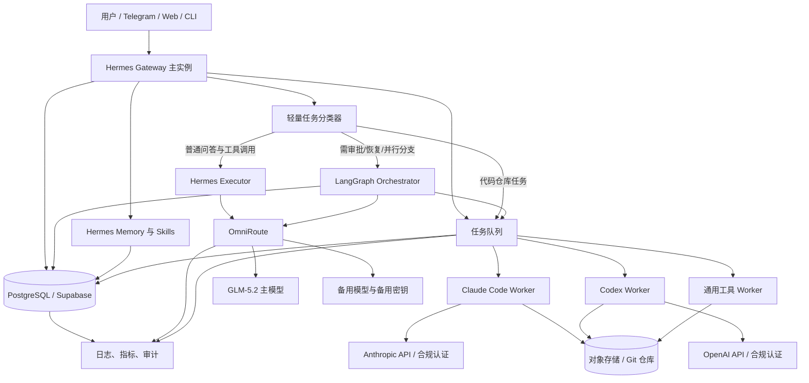
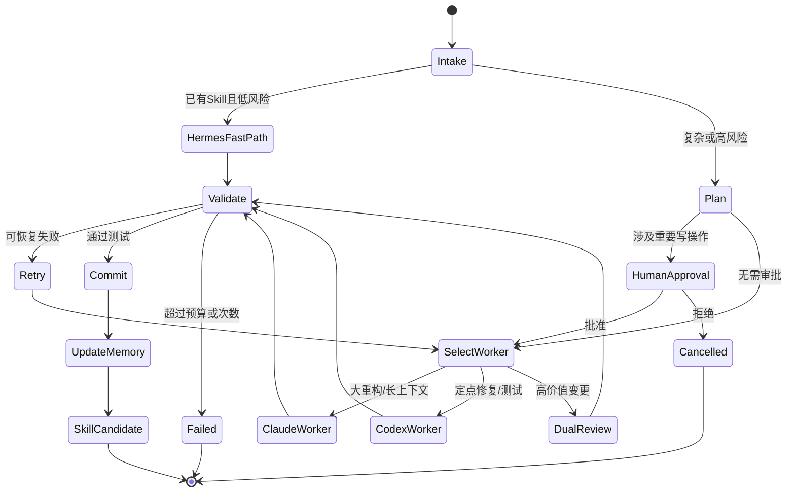
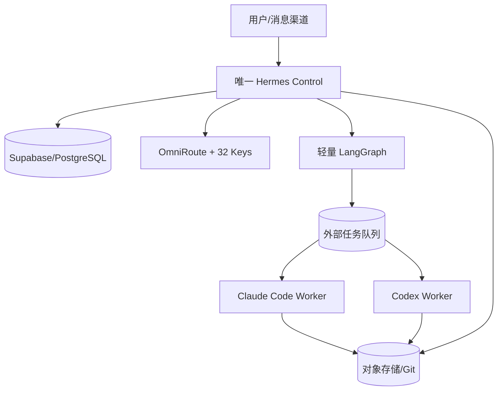

> ⚠️ **本件性质:目标蓝图,非现状描述。** 另 AI 给的方案审查稿(末尾自标"内容由 AI 生成仅供参考"),方向合理可作"该往哪走"参照,**但三处前提与现仓实装/HF 现状脱节,勿当现状读**:
> 1. **"4 免费 Docker 长期部署推翻"已撤** — 4 HF 账号历史免费配额已建 4 Docker Space 稳。2026 新付费政策只限**新建**,历史 Space 不受限。第九节三方案(VPS/降2Space/免费实验)紧迫性已降。
> 2. **下游"受控短命执行器"实为常驻 httpx 透传 thin proxy** — 仓 `claude-code POST /run` timeout120、`codex POST /complete` timeout60 透传 LLM API,无 subprocess/worktree。本文"受控执行器"=目标蓝图 = plan 阶段四方案二(hermes 跑稳后),非现状。
> 3. **Supabase 11 表名实不符 = 命名体系不同非缺表** — 仓实装 8 表(0 同名),3 概念重叠;worker_leases/model_usage/approvals 未实装,artifacts 走 R2 桶非表。
> 4. **omniroute 实情** — 第 5 HF Space `nonoke/omn` 独立账号已跑通(endpoint https://nonoke-omn.hf.space,公开非敏感),暴露 anthropic Messages 兼容 API,glm5.2 经此出。仓内无其代码对(独立 Space)。
>
> ✅ **仍成立 7 点**:LangGraph Checkpointer vs Store 区分 / PostgresSaver 生产可用 / Hermes 长期代理运行时 / 状态分层三套 / 32 Key 额度感知调度 / 单写主+幂等键防脑裂 / CLI 用 API Key。
>
> 现役换装后实装见:`spaces/hermes/*`(主控)、`docs/new/部署/hermes-agent-换装方案.md`、`docs/new/部署/nexus最新架构-查证.md`(查证报告全文)、`docs/new/部署/nexus-agent-team判定.md`。
> 关联记忆:[[nexus-hermes-agent-coreswap-done]] [[nexus-latest-arch-review]]
> ——

### **结论：思路成立，但原方案需要三处关键修正——HF 免费 Docker 目前不能作为四个常驻服务的可靠基础；LangGraph 本身并不需要 8–16GB；Claude Code/Codex Space 应改造成受控、短生命周期的执行器，而不是公开常驻 CLI 容器。**

截至 2026 年 7 月 31 日，更可靠的落地方式是：**Hermes 负责入口、记忆和日常执行；LangGraph 负责少数需要持久状态、审批或并行分支的工作流；Claude Code/Codex 作为隔离编码执行器；OmniRoute 只负责模型路由与密钥池；PostgreSQL/Supabase 保存权威状态。**

## **一、查证后需要纠正的内容**

| 原判断 | 查证结论 | 修正 |
|---|---|---|
| 4 个 HF 免费 Docker Space 可长期部署 | 当前官方文档称，新建 Gradio/Docker Space 需要付费计划；免费账户主要是 Static，以及最多两个 ZeroGPU Gradio Space | 不应把“四个免费 Docker”作为方案前提 |
| 免费 Space 可作为常驻 Gateway/Cron | 免费硬件闲置后会休眠，不保证常驻；唤醒还有冷启动 | Gateway、Cron 应放在 VPS、家庭服务器或付费常驻实例 |
| Space 内 SQLite 可保存 Hermes 状态 | 默认磁盘是临时盘，重启或停止后数据会丢失 | 状态必须外置到 PostgreSQL、对象存储或挂载 Bucket |
| LangGraph 硬件消耗很高 | LangGraph主要是 Python 图执行、状态序列化和数据库访问，不运行本地大模型时资源很轻 | 不能笼统声称需要 8–16GB；多数低并发场景 1–4GB 就能运行 |
| 两个 Hermes 实例可共同积累 Skills | 若无单写者、版本号及冲突处理，会发生重复任务、技能覆盖和记忆分叉 | 一个主实例写入，另一个热备或专门 Worker |
| Claude Code 等于 Computer Use/Artifacts | Claude Code主要是终端编码代理；“Computer Use”和“Artifacts”不是同一部署能力 | 编码执行、桌面操作、可视化产物应分别设计 |
| CLI 容器可直接长期无人值守 | 技术上支持非交互模式，但认证方式、许可边界、审批和沙箱必须单独解决 | 自动化优先使用 API Key、SDK或官方非交互接口，不共享个人登录状态 |

Hugging Face 当前文档明确写明：默认 CPU Basic 为 2 vCPU、16GB RAM、50GB 非持久磁盘；免费硬件会休眠；Docker Space 写入的本地数据会在重启后丢失，并建议使用 Storage Bucket 或外部数据库。更重要的是，当前新建计算型 Gradio/Docker Space需要付费计划。因此，“4 个免费 Docker Space”已经不是一个可稳定复现的部署条件。[Hugging Face Spaces](https://huggingface.co/docs/hub/spaces-overview) [Hugging Face Docker Spaces](https://huggingface.co/docs/hub/spaces-sdks-docker) [Hugging Face Storage](https://huggingface.co/docs/hub/spaces-storage)

## **二、为什么这个组合确实有效**

它有效的根本原因，不是简单地把四个工具叠加，而是将四种不同类型的状态和负载分开。

**Hermes Agent适合承担长期代理运行时。** 官方项目已经包含跨会话记忆、技能创建和迭代、FTS5 会话搜索、Cron、消息 Gateway、并行子代理以及多种终端后端。它天然适合作为用户入口和经验积累层，而不是每次请求都重新构造一个大型 Graph。[NousResearch Hermes Agent](https://github.com/NousResearch/hermes-agent)

**LangGraph适合承担确定性控制流。** 它的优势不是“更聪明”，而是图状态、检查点、暂停恢复、人工审批、故障恢复和跨线程 Store。官方文档将 Checkpointer 定义为线程内图状态，将 Store 定义为跨线程长期数据；生产环境可使用 PostgreSQL 保存状态。因此，LangGraph最有价值的地方是“可恢复和可审计的关键路径”，而不是替代 Hermes 的所有日常循环。[LangGraph](https://docs.langchain.com/oss/python/langgraph/persistence)

**Claude Code与Codex适合承担代码库级执行。** Claude Code支持 `-p` 非交互调用、JSON或流式 JSON 输出、工具白名单、权限模式、会话恢复以及结构化输出。Codex CLI则支持本地仓库检查、编辑、运行命令和 `codex exec` 自动化。这使它们可以被包装成有严格输入输出契约的编码 Worker，而不需要让 LangGraph 自己处理所有文件和终端细节。[Anthropic](https://docs.anthropic.com/en/docs/claude-code/headless) [OpenAI Developers](https://developers.openai.com/codex/cli/)

**OmniRoute适合做模型接入平面，但不应成为业务状态中心。** 多密钥轮询、额度检测、故障切换和 OpenAI 兼容出口很有价值；然而任务状态、记忆、审批和产物索引不应只存在于路由器的 SQLite 中。OmniRoute搜索资料显示其默认使用 SQLite，并提供数据目录和数据库加密变量，因此部署时必须挂载持久卷、设置独立加密密钥，并对数据库做备份。[OmniRoute Wiki](https://github.com/diegosouzapw/OmniRoute/wiki/in%E2%80%90Environment)

## **三、建议采用的最终架构**



这里应当明确区分五个平面：

1. **入口平面**：Hermes Gateway负责身份、会话、渠道、记忆检索和技能选择。
2. **控制平面**：LangGraph只处理需要检查点、审批、补偿、并行或长时间恢复的任务。
3. **执行平面**：Claude Code、Codex和普通工具Worker在独立沙箱执行。
4. **模型平面**：OmniRoute负责GLM-5.2及备用模型、密钥和限额路由。
5. **数据平面**：PostgreSQL保存任务和图状态，对象存储保存大文件，Git保存代码变更。

### **不建议把 LangGraph 作为“被 Hermes 临时启动的库”**

更稳妥的是让 LangGraph 成为一个**常驻但很小的内部服务**，或者直接嵌入 Hermes 主服务进程。所谓“按需启动”在容器环境会引入冷启动、重复任务、状态恢复和子进程回收问题。真正需要按需启动的是执行 Worker，而不是 Graph 控制器。

推荐关系是：

- Hermes通过内部 HTTP/RPC 调用 LangGraph。
- LangGraph把耗时工作写入队列。
- Worker领取任务，并定期发送心跳。
- LangGraph只保存任务引用和结构化摘要，不把完整仓库、日志或大文件塞入图状态。
- Worker退出后，控制器与数据库仍持续存在。

## **四、四个实例应该如何重新分配**

如果你仍希望保持“2 个 Hermes + 2 个编码实例”的逻辑，应采用以下职责，而不是让两个 Hermes 都做主节点：

| 实例 | 职责 | 是否常驻 | 状态写权限 |
|---|---|---:|---|
| Hermes Control | Gateway、路由、记忆检索、Skill选择、Cron调度 | 是 | 主写 |
| Hermes Worker/Standby | 通用工具任务、热备、低风险批处理 | 可按需 | 受限写入 |
| Claude Worker | 大范围重构、规划、长上下文代码任务 | 按任务启动 | 只写工作树和产物 |
| Codex Worker | 定点修复、测试、代码评审、快速迭代 | 按任务启动 | 只写工作树和产物 |

两个 Hermes 实例不能同时无条件写同一份 Skills 和记忆。建议采用：

- `Hermes Control` 是唯一记忆和 Skill发布者。
- Worker只能提交“候选记忆”和“候选 Skill补丁”。
- 主节点审核、去重并生成新版本。
- 每个 Skill包含版本、来源任务、测试结果、适用范围和失效条件。
- 使用 PostgreSQL advisory lock 或分布式锁保证 Cron 单次执行。
- 每项任务必须有 `idempotency_key`，避免休眠唤醒或网络重试导致重复运行。

## **五、模型路由设计**

你的“32 Key + OmniRoute + GLM-5.2 主模型”可以保留，但需要把“多Key”理解为可用性池，而不是简单并发放大器。

建议路由顺序：

```text
默认日常任务
→ GLM-5.2 normal/high
→ 同模型其他合规 Key
→ GLM 较小模型
→ 其他低成本通用模型

复杂规划
→ GLM-5.2 max
→ Claude Code Worker

代码快速修复
→ Codex Worker
→ 失败后 Claude Code复核

长上下文代码审计
→ Claude Code
→ Codex独立复核关键差异
```

Z.AI官方资料确认其工具集成可使用 OpenAI兼容协议，并要求 Coding Plan使用专用 Coding API而不是通用 API。GLM-5.2还需要核对客户端是否已收录模型名；若客户端维护硬编码模型表，即使后端已经支持，也可能返回“未知模型”。[Z.AI](https://docs.z.ai/scenario-example/develop-tools/others) [Z.AI OpenAI SDK](https://docs.z.ai/guides/develop/openai/python)

32个Key应维护以下元数据：

- `provider`
- `key_id`，日志中只记录ID，绝不记录原始Key
- 每分钟请求限制
- 每日或滚动额度
- 当前冷却截止时间
- 连续错误次数
- 最近成功时间
- 允许模型列表
- 成本中心
- 数据保留策略
- 密钥来源与授权范围

调度算法建议使用“**额度感知的加权最少连接**”，而非纯轮询：

```text
score =
可用性权重
× 剩余额度比例
× 健康度
÷ (当前并发 + 1)
```

出现 `429` 时进入冷却；认证失败立即禁用并报警；`5xx`短暂退避；上下文超限不能盲目换Key，应先压缩上下文或切换支持更长上下文的模型。所有Key都应设置单独预算和熔断阈值。

若改用OpenRouter承担部分路由，其官方资料说明可在同模型的不同供应商间自动故障转移，也可通过`models`数组配置模型级回退。但这不能代替应用层幂等控制，因为一次代理任务可能已经执行过部分工具操作。[OpenRouter](https://openrouter.ai/docs/guides/routing/provider-selection)

## **六、Hermes 与 LangGraph 的任务边界**

不要按“任务复杂度感觉”路由，而应使用可验证条件。

### **直接交给 Hermes**

- 单次问答或总结
- 一到三个工具调用
- 已有成熟 Skill可复用
- 不需要中途人工审批
- 失败后可以整体重试
- 任务一般在数分钟内结束
- 不涉及多个并行分支合并

### **交给 LangGraph**

- 任务跨多个阶段并且必须恢复
- 有人工批准、拒绝或修改节点
- 多个Agent并行研究后需要聚合
- 有外部副作用，需要补偿流程
- 必须保留决策路径和状态快照
- 任务可能跨越容器重启
- 成本或风险较高，需要动态预算
- Claude与Codex需要互相复核

一个实用的图可以是：



## **七、Claude Code 与 Codex Worker设计**

两个编码Space不应直接向外提供任意Shell，而应该暴露统一任务接口：

```json
{
  "task_id": "uuid",
  "engine": "claude-code",
  "repository": "git-url-or-artifact-id",
  "base_revision": "commit-sha",
  "objective": "修复指定问题",
  "allowed_paths": ["src/", "tests/"],
  "allowed_commands": ["pytest", "npm test", "git diff"],
  "network_policy": "deny-by-default",
  "timeout_seconds": 1200,
  "max_cost": 2.0,
  "expected_output_schema": "code_task_result_v1"
}
```

返回结果应固定为：

```json
{
  "task_id": "uuid",
  "status": "succeeded",
  "summary": "完成内容",
  "base_revision": "sha",
  "result_revision": "sha",
  "patch_artifact": "object-storage-id",
  "tests": [
    {
      "command": "pytest -q",
      "exit_code": 0
    }
  ],
  "changed_files": ["src/a.py"],
  "warnings": [],
  "usage": {
    "duration_seconds": 180
  }
}
```

Claude Code官方非交互方式可使用 `claude -p`，支持JSON、流式JSON、结构化Schema、允许工具列表和权限模式。不要使用完全跳过权限检查的高权限模式；允许命令应尽量精确到具体工具或命令模式。[Anthropic](https://docs.anthropic.com/en/docs/claude-code/headless)

Codex使用`codex exec`进入非交互流程，并为每个任务创建独立Git工作树。完成后只返回补丁、提交和测试结果。不要让Claude与Codex直接共享同一个可写目录，否则并行编辑会产生覆盖和不可重现结果。[OpenAI Developers](https://developers.openai.com/codex/cli/)

### **CLI认证的重要限制**

自动化执行器应优先使用：

- 官方API Key；
- 官方支持的工作负载身份；
- 官方Agent SDK；
- 官方CI/GitHub Action集成。

不应把个人订阅登录缓存复制到公开Space，也不应让多个用户共享个人CLI会话。CLI登录态与API凭证的授权、计费、并发和使用条款可能不同，应按各服务当前条款核验。

## **八、数据与持久化设计**

PostgreSQL建议至少包含：

| 表 | 用途 |
|---|---|
| `agent_sessions` | Hermes会话元数据 |
| `tasks` | 任务状态、优先级、幂等键 |
| `task_events` | 追加式事件日志 |
| `graph_threads` | LangGraph线程映射 |
| `worker_leases` | Worker租约与心跳 |
| `memory_candidates` | Worker提交的候选记忆 |
| `skill_versions` | Skill版本与验证状态 |
| `model_usage` | 模型、Key、成本与延迟 |
| `artifacts` | 产物位置、哈希和生命周期 |
| `approvals` | 人工审批记录 |

LangGraph的 Checkpointer 与 Hermes 长期记忆不能混为一谈：

- **Checkpointer**：保存某个工作流执行到哪一步。
- **Store**：跨线程共享的偏好、事实和长期知识。
- **Hermes Memory**：面向用户和代理经验的召回层。
- **Skill Registry**：可执行程序性知识，必须版本化和测试。
- **Artifact Store**：源码压缩包、补丁、日志和报告等大对象。

不要把完整聊天历史、完整仓库内容和大段工具日志不断写入LangGraph state。State只保存引用、摘要、哈希和必要的结构化结果。官方文档也提醒检查点可能持续增长，需要设置清理策略。[LangGraph](https://docs.langchain.com/oss/python/langgraph/persistence)

## **九、HF部署在当前条件下的可行版本**

### **方案A：最推荐**

- 一台低价VPS或家用服务器：Hermes Control、LangGraph、队列客户端。
- Supabase/PostgreSQL：权威状态。
- S3兼容对象存储：产物。
- Claude Code/Codex：在CI Runner、短生命周期容器或沙箱平台按需运行。
- HF Space：只做演示前端或公开Webhook接入，不保存权威状态。

基础服务若不运行本地模型，通常可以从以下规格起步：

- 2–4 vCPU
- 4–8GB RAM
- 30–60GB SSD
- 外置PostgreSQL
- 无GPU

并发Worker、浏览器自动化或大型Node构建增加后，再提升到8 vCPU、16–32GB。你原来的“8核+32GB”属于舒服配置，但不是LangGraph的必需配置。

### **方案B：坚持使用HF**

可把计算型Space降为两个，而不是四个：

- Space 1：轻量入口和Hermes API。
- Space 2：合并后的编码Worker，根据任务选择Claude或Codex。

但必须接受：

- 当前创建Docker Space需要相应付费计划；
- 免费硬件会休眠；
- Cron不能依赖Space进程持续存在；
- 容器重启导致本地状态丢失；
- 只能暴露一个主要应用端口；
- 出站网络主要允许HTTP/HTTPS及8080；
- 必须通过Space Secrets注入凭证；
- 任务队列、数据库和对象存储全部外置。

### **方案C：完全免费实验版**

“完全免费且可靠常驻”不能同时保证。可以做概念验证：

- 静态HF Space作为前端；
- Supabase免费层保存状态；
- GitHub Actions或其他CI执行短任务；
- 外部按需API完成推理；
- 不承诺24小时Gateway、即时Cron和稳定低延迟。

这适合个人试验，不适合作为生产系统。

## **十、安全、可靠性与成本控制**

该架构最大的风险不是内存，而是代理拥有终端和代码写权限后产生的副作用。

必须落实以下控制：

1. 每个任务使用全新工作目录或Git worktree。
2. 默认禁止访问宿主Docker Socket。
3. 默认禁止读取其他任务的凭证和文件。
4. 网络默认关闭，只为依赖源和必要API建立白名单。
5. 非root用户运行，文件系统尽量只读。
6. 每个任务设置CPU、内存、进程数、磁盘和超时限制。
7. 密钥只在任务生命周期内注入，结束后销毁。
8. 外部内容不能直接变成Shell命令。
9. 删除、发布、支付、合并主分支和部署生产环境必须人工审批。
10. 提交前运行测试、静态检查和差异审查。
11. 产物记录SHA-256、基础提交和执行器版本。
12. 所有重试使用幂等键；外部副作用采用事务发件箱或补偿节点。
13. 日志自动脱敏API Key、Cookie、Authorization头和环境变量。
14. 给每项任务设置Token、时间和金额预算。
15. Hermes自动创建的Skill先进入候选区，通过回放测试后再发布。

成本控制不应只看模型单价，还应记录：

```text
总成本 =
模型输入费用
+ 模型输出费用
+ 重试费用
+ Worker运行时间
+ 存储与数据库
+ 失败任务浪费
```

建议对每条路由建立SLO：

| 指标 | 建议初始目标 |
|---|---|
| 普通Hermes任务成功率 | ≥ 98% |
| 编码任务首次成功率 | ≥ 70% |
| 重试后成功率 | ≥ 90% |
| 重复副作用次数 | 0 |
| Gateway可用性 | ≥ 99.5% |
| P95普通任务延迟 | < 30秒 |
| Worker超时率 | < 5% |
| Skill回归通过率 | 100%后发布 |

## **十一、推荐实施顺序**

### **第一阶段：最小闭环**

先只部署一个Hermes主实例、OmniRoute和PostgreSQL。打通：

```text
用户请求
→ Hermes
→ GLM-5.2
→ 简单工具调用
→ 结果与记忆写回
```

此阶段不要加入LangGraph和两个编码CLI，先验证模型路由、Key熔断、会话保存和Secrets管理。

### **第二阶段：加入统一任务队列**

实现`tasks`、`task_events`、Worker租约、超时回收和幂等键。所有耗时任务从Hermes进程剥离。此时接入一个Codex Worker，先覆盖修复、测试和审查。

### **第三阶段：接入Claude Code**

将大范围重构、长上下文分析和复杂规划交给Claude Worker。要求两个Worker都返回相同结果Schema，不让上层依赖某个CLI的原始文本格式。

### **第四阶段：只为关键流程引入LangGraph**

优先选择一个真正需要持久状态的场景，例如：

```text
需求分析
→ 人工批准计划
→ Claude实现
→ Codex复核
→ 测试
→ 人工批准合并
→ 写回Skill候选
```

用PostgreSQL Checkpointer验证进程重启后可继续执行。

### **第五阶段：Skill演化**

只有当同类任务重复出现并且结果稳定时，才让Hermes生成Skill候选。通过历史任务回放、权限检查和版本审批后发布，避免“错误经验自动固化”。

## **十二、最终部署判断**

这套组合的核心判断是正确的：**Hermes提供长期代理人格和经验复用，LangGraph提供可恢复的确定性编排，Claude Code/Codex提供高质量代码执行，OmniRoute提供模型和密钥弹性。**

但更准确的评价不是“目前降低硬件消耗的最优方案之一”，而是：

> 它是一种合理的轻控制平面、重外部执行架构。其主要收益来自状态分层、按需执行和API模型外包，而不是LangGraph本身非常耗硬件。实际瓶颈通常会落在平台休眠、状态持久化、CLI认证、并发配额、任务幂等和沙箱安全上。

最关键的最终修改是：

- 不依赖4个HF免费Docker长期运行；
- Hermes只保留一个权威写入主节点；
- LangGraph常驻但轻量，只处理关键图；
- Claude/Codex使用短生命周期隔离Worker；
- 所有状态和产物外置；
- 32个Key采用授权范围内的健康度与额度调度；
- GLM-5.2作为默认模型，但为工具调用失败、模型不可用和上下文超限分别设置不同回退路径。

使用两个 Hermes 实例而非一个，其核心逻辑在于**“读写分离”**与**“高可用性”**，这在处理长生命周期的自主代理任务时至关重要。

虽然对于简单问答，一个实例绰绰有余，但在你设计的“混合架构”中，Hermes 承载了记忆（Memory）和技能（Skills）的迭代。如果只有一个实例，当它正在执行复杂的后台任务（如大规模代码重构或 Cron 审计）时，你的实时指令可能会被阻塞或延迟。

以下是采用两个 Hermes 实例的深度考量：

### **1. 性能与响应的隔离 (隔离 UI 与任务负载)**
*   **Hermes Control (主节点)**：它像一个“接线员”和“图书管理员”。它的主要工作是维持与你的 Telegram/Discord 通信，快速检索过去聊过什么（记忆），并从技能库中挑出最合适的工具。它不直接跑“重活”，因此能保证无论后台在干什么，它都能秒回你的消息。
*   **Hermes Worker (任务节点)**：它像一个“实验室研究员”。它负责执行那些耗时的工具调用、数据处理或与子代理的长时间通信。如果任务中途崩溃或导致内存溢出，受影响的只是这个 Worker 节点，你的主 Control 节点依然在线，你可以通过主节点下达 `/stop` 指令或查看错误日志。

### **2. 解决“脑裂”与状态竞争问题**
这是最关键的一点。Hermes Agent 具有**自学习循环**，它会根据任务结果修改自己的 `SKILLS.md` 和记忆库。
*   **如果两个实例都是主节点**：它们可能同时尝试修改同一个技能文件，导致文件损坏或逻辑覆盖（例如：实例 A 刚学会了用 Python 处理 Excel，实例 B 却把它覆盖成了处理 CSV 的旧版本）。
*   **采用主从架构**：`Control` 实例拥有唯一的“写权限”。`Worker` 实例在完成任务后，会将建议的变更（候选记忆/候选技能）发送给 `Control`，由主节点进行去重、验证后再统一落盘。这保证了你的 Agent 经验增长是线性的、不冲突的。

### **3. 实现“热备份”与故障恢复**
在 Hugging Face Spaces 这种可能会休眠或因硬件配额重启的环境下，单实例非常脆弱。
*   **状态同步**：当主节点因为 HF 的调度机制重启时，处于“热备”状态的 `Worker` 实例可以暂时接管基础的 Gateway 功能，或者至少保证正在进行的后台任务不会因为 UI 进程的闪退而彻底丢失进度。
*   **按需扩展**：在任务量激增时（例如你突然要求审计三个不同的代码库），你可以临时拉起更多的 `Worker` 实例，而你的 `Control` 节点始终作为稳定的唯一入口存在。

### **4. 混合架构中的“大脑调度”优化**
在你的方案中，LangGraph 负责复杂决策。这时两个 Hermes 实例的配合如下：
1.  **Control 节点**接收你的请求，并调用 LangGraph。
2.  **LangGraph** 将子任务下发给 **Worker 节点**。
3.  **Worker 节点**调用 Claude Code/Codex 完成代码工作。
4.  **Worker 节点**向 **Control 节点**汇报：“任务完成，这是我总结的新经验”。
5.  **Control 节点**更新数据库，你的 Agent 变强了。

这种结构模拟了**“感官（Control）- 逻辑（LangGraph）- 肌肉（Worker）”**的生物模型。

### **总结建议**
如果你追求极致的简单且任务量很小，**一个 Hermes 实例确实更省资源**。

但如果你希望构建一个**“越养越强”且具备工业级稳定性**的系统，使用两个 Hermes 实例能让你在不增加太多硬件成本（因为 Worker 可以按需启停）的前提下，获得极高的系统健壮性和数据一致性。这能有效防止 Agent 在自我进化过程中出现“逻辑混乱”或“记忆碎片化”。

整个系统这样设计，是因为hf免费docker不能持久化还是其他原因？容器cpu太差？使用双hermes？

### **不是因为 HF CPU 太差，也不只是因为不能持久化；双 Hermes 主要解决的是任务隔离和可用性，但对你的低负载方案并非必需。优先采用“单 Hermes + 外部数据库 + 两个按需编码 Worker”，通常更合理。**

### **三个问题需要分开看**

| 问题 | HF 免费/基础 Space 的实际影响 | 是否构成双 Hermes 的理由 |
|---|---|---|
| 本地磁盘不持久 | 重启、休眠或重建后，SQLite、记忆和 Skills可能丢失 | **不是**，加第二个Hermes也解决不了 |
| 免费实例会休眠 | Gateway和进程内Cron无法保证24小时运行 | **部分是**，但两个都休眠时仍无法高可用 |
| 只有2 vCPU | 并发构建、依赖安装、测试时较慢 | **部分是**，但应通过Worker隔离解决 |
| 单进程执行耗时任务 | 长任务可能影响消息响应和任务调度 | **是**，但未必需要完整的第二个Hermes |
| 单点故障 | 主Hermes重启时入口暂时中断 | **是**，但HF免费层不能真正实现可靠热备 |
| 记忆和Skill并发写入 | 多个Hermes可能冲突 | 反而是双Hermes带来的新问题 |

## **主要原因其实是HF的运行模型**

### **1. 非持久磁盘是最直接的问题**

Hermes的价值主要来自长期状态：

- 用户记忆；
- 会话记录；
- Skills；
- Cron配置；
- Gateway配置；
- 本地SQLite；
- 任务执行记录。

如果这些内容只放在Space容器内，容器重启、停止或重建后可能丢失。即使部署两个Hermes，只要两个都依赖各自的临时磁盘，就会形成两套分叉状态，而不是提高可靠性。

正确解决方式是：

```text
Hermes
   ├── PostgreSQL/Supabase：任务、记忆索引、状态、审批记录
   ├── 对象存储：Skills版本、日志、补丁、产物
   └── Git仓库：可审计的Skill和配置版本
```

因此，**持久化问题应该用外部存储解决，不能用双实例解决**。

### **2. 休眠比CPU性能更关键**

HF基础CPU的2 vCPU和16GB内存足以运行：

- Hermes Agent本身；
- 轻量LangGraph；
- FastAPI；
- 小规模状态处理；
- API模型调用；
- 简单文本处理。

因为GLM-5.2、Claude和Codex的模型推理发生在外部服务，Space并不承担大模型推理。多数时候，CPU只负责网络请求、JSON解析、路由和数据库操作。

真正容易拖慢Space的是：

- `npm install`、`pip install`；
- 大型代码库扫描；
- TypeScript编译；
- 单元测试；
- 同时运行多个Claude/Codex任务；
- 浏览器自动化；
- 多个子进程；
- 压缩或解压大型仓库。

所以HF CPU不是“跑不动Hermes”，而是**不适合把入口、调度和代码执行全部塞进同一个容器**。

### **3. 免费硬件休眠会破坏常驻服务语义**

Hermes Gateway和Cron都假设进程持续运行，但免费硬件可能在空闲后停止：

```text
Space休眠
→ Hermes Gateway离线
→ 进程内Cron不会触发
→ 正在内存中的任务消失
→ 外部消息不能保证立即处理
```

即使任务状态已经写进PostgreSQL，系统醒来后可以恢复，仍然不能保证“定时准点运行”和“消息即时响应”。

第二个免费Hermes Space不能彻底解决这个问题，因为它也可能休眠。真正的解决办法是：

- 由外部Cron定时调用Space；
- 任务全部写入外部队列；
- 每个任务可幂等重试；
- 关键Gateway迁移到低价VPS或常驻平台；
- 将HF定位为可唤醒Worker，而不是唯一控制中心。

## **为什么之前建议双Hermes**

双Hermes的合理动机只有两个：

### **任务隔离**

主Hermes只负责：

- 接收请求；
- 会话管理；
- 读取记忆；
- 路由；
- 调用LangGraph；
- 返回任务进度。

第二个Hermes负责：

- 通用工具执行；
- 批处理；
- 研究任务；
- 低风险自动化；
- 候选Skill生成。

这样某个工具任务卡死、内存暴涨或子进程泄漏时，不会直接拖垮Gateway。

但这并不意味着必须启动第二个完整Hermes。一个普通Python Worker、任务队列消费者，甚至LangGraph Worker都可以完成同样的隔离，而且结构更简单。

### **故障隔离或热备**

第二个Hermes可以作为备用入口，但真正的热备需要：

- 外部负载均衡；
- 健康检查；
- 自动故障转移；
- 共享数据库；
- Gateway会话接管；
- Cron leader election；
- 单写锁；
- 消息去重；
- 两个实例不能同时消费同一事件。

如果这些机制没有实现，“双Hermes”只是两个独立容器，不是真正的高可用集群。部署在两个会休眠的免费Space上，其高可用价值尤其有限。

## **你的场景更适合单Hermes**

在目前架构下，建议调整为：



### **实例重新分配**

| 实例 | 建议用途 | 原因 |
|---|---|---|
| Space 1 | Hermes Control + 轻量LangGraph | 统一入口和唯一状态写入者 |
| Space 2 | OmniRoute或通用工具Worker | 模型路由与执行负载不影响入口 |
| Space 3 | Claude Code Worker | 隔离复杂编码和长任务 |
| Space 4 | Codex Worker | 隔离测试、修复和代码评审 |

这比“两个Hermes”更清晰。Hermes本身已有子代理、终端后端和并行能力；除非确实出现并发瓶颈或需要备用Gateway，否则没必要重复部署完整控制层。

## **什么时候才应该使用双Hermes**

只有满足以下至少一项时，第二个Hermes才有明显价值：

1. 主Hermes经常被长任务阻塞，并且无法通过队列Worker解决。
2. 同时服务多个用户或多个消息渠道，并发明显增加。
3. 需要将私人记忆代理与公共自动化代理彻底隔离。
4. 需要独立安全域，例如一个只能读取，一个允许执行工具。
5. 有真正的常驻基础设施支持主备切换。
6. 两套Hermes承担完全不同的职责和Skill集合。
7. 已经实现共享数据库、任务去重、Leader锁和故障转移。

如果只是一个用户、日常自动化和少量编码任务，双Hermes通常会增加：

- 配置维护；
- 状态同步；
- Skill冲突；
- 记忆重复；
- Cron重复执行；
- API消耗；
- 故障排查难度。

## **对当前方案的最终建议**

采用以下简化版：

```text
1个 Hermes
+ 1个轻量LangGraph
+ 1个外部PostgreSQL/Supabase
+ 1个OmniRoute
+ Claude Code Worker
+ Codex Worker
```

其中LangGraph可以与Hermes放在同一个Space或同一进程中，不一定单独占实例。Claude与Codex Worker按任务启动或被唤醒；所有任务先写入数据库或队列，执行完成后返回结构化结果。

如果只有四个Space，优先级应是：

1. Hermes + LangGraph；
2. OmniRoute；
3. Claude Worker；
4. Codex Worker。

因此，**双Hermes不是由HF非持久化强制产生的，也不是因为Hermes吃CPU，而是一种在高并发、任务隔离或真正高可用条件下才值得采用的扩展设计。对你的HF低成本架构而言，一个Hermes通常更好。**

*内容由 AI 生成仅供参考*