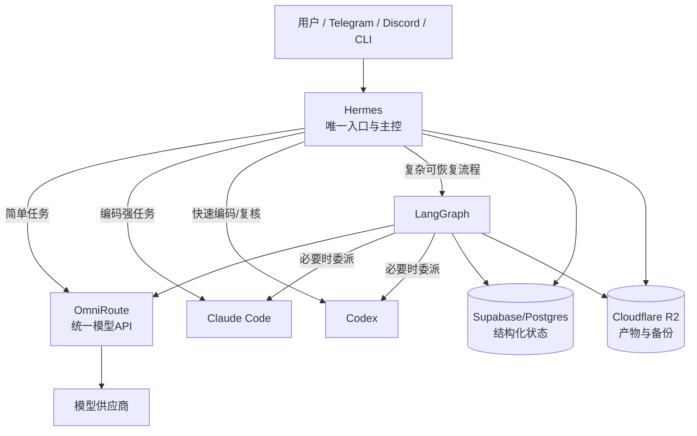

### **没有必要一开始做得这么复杂；对当前 Nexus，最合理的是“三个核心组件”，而不是五层网关与多个 Agent Runtime。**

按第一性原理，系统真正需要完成的只有三件事：**接收并编排任务、调用合适模型或编码工具、可靠保存状态和产物**。因此，现阶段建议只保留：

1. **Hermes**：用户入口、记忆、Skills、Cron，以及调用编码 Agent；
2. **LangGraph**：只处理确实需要断点恢复、审批或多步骤状态机的任务；
3. **OmniRoute**：统一模型接口、模型切换与 fallback。

Supabase/Postgres 和 R2作为存储保留。**暂不引入 Omnigent、Agentgateway、A2A，也不用把 Claude Code、Codex 各部署成独立 Space。**

# **为什么之前的设计过度了**

之前的完整架构同时包含：

```text
Nexus Controller
→ LangGraph
→ Omnigent
→ Hermes / Claude Code / Codex
→ Agentgateway
→ OmniRoute
→ 模型供应商
```

这里出现了明显的职责重叠：

| 重叠点 | 问题 |
|---|---|
| Nexus Controller 与 Hermes | 都想做入口、路由、任务管理 |
| LangGraph 与 Omnigent | 都想做执行器编排 |
| Hermes 与 Omnigent | Hermes 本身已经能委派 Claude Code、Codex |
| Agentgateway 与 OmniRoute | 都提供部分 LLM 网关、fallback、限流和观测 |
| Worker 与 Agentgateway | 都做鉴权和转发 |
| Supabase 业务状态与多个 Agent 会话库 | 容易形成多个事实源 |

每新增一层，都会增加部署、冷启动、鉴权、日志关联、超时、重试和版本兼容问题。对于个人或小团队系统，这些成本通常大于收益。

LangChain 官方文档也明确建议：**只有少量工具时使用单 Agent；拥有多个明显独立领域并需要上下文隔离时，才采用 Subagents。** 对类别清晰的请求，使用简单规则或轻量 Router，而不是完整 Supervisor。[LangChain](https://docs.langchain.com/oss/python/langchain/multi-agent/subagents) [LangChain](https://docs.langchain.com/oss/python/langchain/multi-agent/router)

# **关键事实：Hermes 已经能连接 Claude Code 和 Codex**

最重要的新核查结果是：**官方 Hermes 仓库已经包含 Claude Code 的编排 Skill**，并明确把 Claude Code 作为可委派的编码 Agent；该 Skill 还说明了 TUI、PTY、tmux、预算和权限控制等实际问题。[Hermes Agent](https://github.com/NousResearch/hermes-agent/blob/main/skills/autonomous-ai-agents/claude-code/SKILL.md)

此外，Hermes 当前具有：

- 外部 Agent 委派；
- MCP；
- ACP 服务器/适配能力；
- Skills；
- Cron；
- Memory；
- Profile；
- 模型 Provider；
- Claude Code/Codex 相关工作流。

这意味着“为了连接 Hermes、Claude Code、Codex，再加一个 Omnigent”不是当前必要条件。Omnigent 只有在你需要同时统一管理大量不同 Agent Runtime、多个沙箱和团队策略时才有价值。

# **推荐的最小架构**



## **每个组件只做一件事**

| 组件 | 唯一职责 |
|---|---|
| Hermes | 唯一入口、个人记忆、Skills、Cron、简单路由、调用编码 Agent |
| LangGraph | 有状态、可恢复、需审批的复杂流程 |
| Claude Code | 大型代码实现、仓库级重构 |
| Codex | 快速编码、第二意见、并行复核 |
| OmniRoute | 模型供应商抽象、模型 fallback、用量路由 |
| Postgres | 任务、状态、日志、Checkpoint |
| R2 | 文件、报告、工作区归档、备份 |

这里不需要额外 Nexus Controller。**Hermes 就是控制面。**

但有一个前提：如果 Hermes 无法作为稳定的 HTTP 服务供外部系统调用，才保留一个极薄的 Nexus API Adapter。它只做协议转换：

```text
POST /tasks → Hermes/Skill/ACP
```

这个 Adapter 不再做第二套路由、第二套记忆或第二套任务编排。

# **LangGraph 也不应默认介入每个请求**

LangGraph 只有满足以下任一条件才调用：

- 任务跨多个步骤且需要持久化；
- 中途可能暂停并等待人工批准；
- 需要失败后从 Checkpoint 恢复；
- 需要明确并行分支和结果汇合；
- 任务可能运行很久；
- 对执行顺序有严格要求。

下面这些任务直接由 Hermes 处理：

- 普通聊天；
- 搜索和摘要；
- 单次模型调用；
- 单工具调用；
- 简单脚本；
- 一次 Claude Code 或 Codex 委派；
- 定时提醒和健康检查。

这是把 LangGraph 从“所有任务的中间层”降级为“复杂流程工具”，可显著降低系统复杂度。

# **OmniRoute 与 Hermes 的关系**

所有模型调用尽可能通过 OmniRoute 的 OpenAI 兼容接口：

```text
Hermes ─────┐
LangGraph ──┼──> OmniRoute /v1 → Provider
Codex* ─────┘
```

但要注意，Claude Code 与 Codex 是否能完全通过 OmniRoute，取决于 OmniRoute 对其认证方式、API 方言、流式响应、工具调用和模型能力的兼容程度。不能只因为它提供 OpenAI 兼容接口，就假定所有 CLI 功能都能正常工作。

因此应分两类：

- **普通模型调用**：强制走 OmniRoute；
- **Claude Code/Codex 特有登录或订阅能力**：必要时直接使用其官方后端，不强行代理。

# **不建议现在加入的组件**

## **Omnigent：暂缓**

仅在这些条件出现时再引入：

- 同时运行 5 个以上不同 Agent Runtime；
- 需要统一沙箱；
- 需要跨机器管理 Agent；
- 需要统一取消、恢复和会话共享；
- Hermes 的委派能力确实无法满足需求。

目前只有 Hermes、Claude Code、Codex 三类执行者，Hermes 原生编排已足够。

## **Agentgateway：暂缓**

Agentgateway 同时提供 LLM、MCP、A2A 网关，能力完整但对应的是多团队、多 Agent、多工具的治理场景。[Agentgateway](https://github.com/solo-io/agentgateway-new-ui)

只有出现以下需求才值得部署：

- MCP Server 超过约 5 个；
- 多租户；
- OAuth/RBAC；
- 统一审计；
- 工具级权限；
- Agent 到 Agent 的跨网络发现；
- Kubernetes 部署。

个人 Nexus 没有这些需求时，自建一个 Agentgateway 只是增加运维。

## **A2A：暂缓**

A2A 解决的是独立 Agent 服务跨网络互相发现和通信。当前 Claude Code、Codex 更适合作为 Hermes 的“工具/子 Agent”，没有必要把它们升级成自治网络服务。

原则是：

> 能用函数调用就不用 MCP；能用 MCP 就不用 A2A；只有独立部署、独立身份和异步协作时才使用 A2A。

# **部署方式也应该收缩**

在 HF 上，建议最多两个运行单元：

```text
Space 1：Hermes + Claude Code + Codex + OmniRoute
Space 2：LangGraph API（可选，甚至先同进程）
外部：Supabase + R2
```

更激进、更合理的第一阶段是单 Space：

```text
Hermes
├── OmniRoute
├── Claude Code CLI
├── Codex CLI
└── LangGraph Python模块
```

限制并发 Agent 数为 1，任务串行。因为 HF CPU Basic 只有 2 vCPU 和 16GB RAM，多个常驻 Agent 并不能提升真实吞吐，反而会增加内存和上下文竞争。[Hugging Face](https://huggingface.co/docs/hub/spaces-overview)

# **演进路线**

## **阶段 1：能跑**

只部署：

```text
Hermes + OmniRoute + R2
```

让 Hermes 可以聊天、调用模型、保存产物。

## **阶段 2：能编码**

加入：

```text
Claude Code + Codex
```

通过 Hermes Skills/委派调用，验证预算、权限、超时和工作区隔离。

## **阶段 3：能恢复**

只针对长流程加入：

```text
LangGraph + Postgres Checkpoint
```

不要让全部任务经过 LangGraph。

## **阶段 4：确有规模后再治理**

根据实际瓶颈择一加入：

- Agent Runtime 太多 → Omnigent；
- MCP/A2A 权限复杂 → Agentgateway；
- 跨网络 Agent 协作 → A2A；
- 高并发 → 队列和独立 Worker。

# **最终架构决策**

当前 Nexus 应调整为：

```text
Hermes（主控）
├── OmniRoute（模型网关）
├── Claude Code（强编码工具）
├── Codex（快编码/复核工具）
└── LangGraph（按需复杂工作流）
    ├── Supabase/Postgres（状态）
    └── R2（产物）
```

**删除或暂缓：Omnigent、Agentgateway、A2A、四个独立 HF Space、重复的 Nexus Controller 路由层。**

这是当前需求下最小、可解释、可测试的方案。复杂度应由真实问题触发，而不是由未来可能出现的规模预付。

*内容由 AI 生成仅供参考*