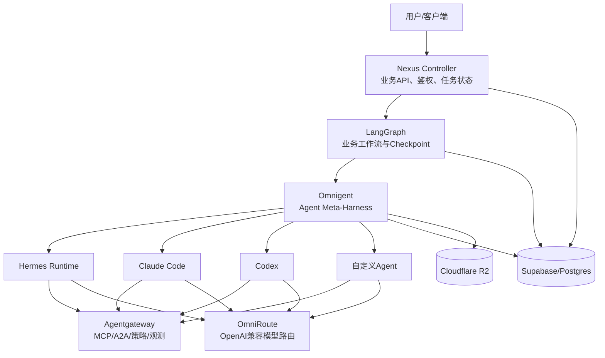
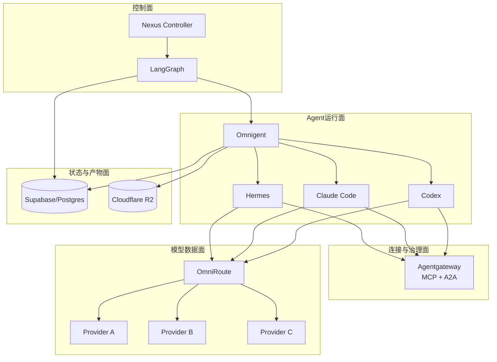

### **有，但没有一个项目能无改造地把全部组件“一键连接”；最匹配的是 Omnigent，生产通信层则是 Agentgateway。**

对 Nexus 来说，最合理的组合不是再找一个新的总编排框架替换 LangGraph，而是：

- **Omnigent**：统一管理 Hermes、Claude Code、Codex 等不同 Agent Runtime；
- **LangGraph**：继续负责确定性业务工作流、状态和 Checkpoint；
- **Agentgateway**：统一处理 MCP、A2A、鉴权、治理和可观测性；
- **OmniRoute**：只负责模型 API 路由、供应商切换、配额与降级；
- **Nexus Controller**：保留为业务控制面与唯一外部任务入口。

## **候选项目判断**

| 项目 | 连接 Agent | MCP/A2A | 模型路由 | 与 Nexus 的最佳定位 |
|---|---:|---:|---:|---|
| **Omnigent** | 很强 | 可扩展 | 可接外部网关 | 最接近“连接一切”的 Agent 元运行时 |
| **Agentgateway** | 强 | 原生支持 | 内建，但可不用 | 生产级通信与治理平面 |
| **a2abridge** | Claude Code/Codex 很强 | MCP↔A2A | 不负责 | 轻量原型和本地多 Agent 互联 |
| **MCP Context Forge** | 通过协议连接 | MCP、REST、A2A 聚合 | 不是重点 | 偏工具网关与协议桥 |
| **OmniRoute** | 不编排 Agent | 不负责 | 很强 | 独立模型数据面 |
| **Dify/Flowise** | 有限 | 以 MCP/工作流为主 | 有 | 更适合低代码应用，不适合统管这些 CLI Agent |

---

# **首选：Omnigent**

目前查到与需求最吻合的是开源项目 **Omnigent**。它不是另一个简单 Agent 框架，而是位于现有 Agent 之上的 **meta-harness（元运行时）**：通过统一规格调用和治理 Claude Code、Codex、Hermes、OpenAI Agents、自定义 Agent 等不同执行器。

其公开规格明确列出了多种 `executor harness`，包括 Claude SDK、Codex、Cursor、Hermes 等；支持异步、取消、工作目录、网络权限、工具定义和多种沙箱。项目依赖也包含 OpenTelemetry、数据库压缩和 S3 兼容 Artifact Store；后者可通过 `s3://` URI 对接 Cloudflare R2。这一点与 Nexus 当前的 R2、Postgres、Agent 分层高度吻合。[Omnigent Agent YAML Spec](https://github.com/omnigent-ai/omnigent/blob/main/docs/AGENT_YAML_SPEC.md) [Omnigent pyproject](https://github.com/omnigent-ai/omnigent/blob/main/pyproject.toml)

Omnigent 最适合承担：

- 统一启动 Hermes、Claude Code、Codex；
- 为各 Agent 分配独立工作区；
- 统一超时、取消、网络与文件权限；
- 把执行结果和产物写入 R2；
- 统一追踪和会话；
- 把 Agent 作为 LangGraph 节点的可调用执行器。

但需要明确一点：**Omnigent 搜索结果和公开规格显示它很新。** 在正式采用前必须验证其许可证、版本稳定性、Hermes harness 是否真的可运行、资源占用及 HF Docker 环境兼容性。它适合作为候选 PoC，不应未经测试直接成为唯一生产依赖。

### **建议调用关系**



---

# **生产通信层：Agentgateway**

如果你真正想要的是“让模型、工具、Agent 相互连接的一张网络”，**Agentgateway** 比单纯 MCP 聚合器更完整。项目定位就是面向 Agent 的开源代理，统一提供：

- LLM Gateway；
- MCP Gateway；
- A2A Gateway；
- Agent 到模型、Agent 到工具、Agent 到 Agent 的鉴权；
- 负载均衡与故障转移；
- 预算与成本控制；
- 可观测性与治理；
- Guardrails。

它是 Linux Foundation 项目，采用 Apache 2.0 许可证。其范围与 Nexus 的 Worker Gateway 有较大重叠，但能力远高于当前自建的简单 HTTP 转发 Worker。[Agentgateway GitHub](https://github.com/solo-io/agentgateway-new-ui)

不过，Agentgateway 不应该取代 LangGraph：

- Agentgateway 解决的是**通信、协议与治理**；
- LangGraph 解决的是**任务状态、分支、恢复与工作流**；
- Omnigent 解决的是**不同 Agent Runtime 的统一执行**；
- OmniRoute 解决的是**模型供应商路由**。

这是四个不同层次，混用职责会让系统重新失控。

---

# **轻量替代：a2abridge**

如果暂时不想引入 Omnigent 和 Agentgateway 两个较重组件，可以先用 **a2abridge** 做 PoC。

该项目提供单一 Go 二进制，通过 MCP stdio 接入 Claude Code、Codex、Cursor、Cline、Continue、Gemini 等，再把每个客户端桥接为 A2A Agent；内置本地 Agent Directory，用于注册、发现和心跳。它特别适合验证 Claude Code 与 Codex 是否能互相发现和委派任务。[a2abridge GitHub](https://github.com/vbcherepanov/a2abridge)

它的局限也很明确：

- 更偏本机或同一主机上的 Agent Mesh；
- 不负责业务 Checkpoint；
- 不负责 R2/Supabase；
- 不负责完整模型供应商路由；
- Hermes 可能需要自行补一个 MCP/A2A 适配器；
- 不适合作为 Nexus 最终控制面。

所以它适合“先把 Claude Code、Codex 和自定义 Agent 连起来”，不适合取代 Nexus。

---

# **OmniRoute 应放在哪里**

OmniRoute 是本地优先的模型路由网关，提供统一 OpenAI 兼容 `/v1` 接口，并负责上游协议转换、fallback、Token 刷新和用量追踪。它不是 Agent 编排器，也不是 MCP/A2A 网关。[OmniRoute Architecture](https://github.com/diegosouzapw/OmniRoute/wiki/Architecture)

正确连接方式是：

```text
Hermes ───────┐
Claude Code ──┼──> OmniRoute /v1 ──> 模型供应商
Codex ────────┤
LangGraph LLM ┘
```

OmniRoute 不应：

- 保存 LangGraph 状态；
- 调度 Claude Code 或 Codex 进程；
- 充当 Agent Directory；
- 代替 Nexus Controller；
- 直接管理任务队列。

## **OmniRoute 与 Agentgateway 的功能重叠**

Agentgateway 本身已有 LLM Gateway，和 OmniRoute 会产生模型路由重叠。应明确单一所有者：

### **推荐方案**

- Agentgateway 的 LLM 功能只做鉴权、审计、限流；
- OmniRoute 负责供应商选择、模型映射和 fallback；
- 请求链为 `Agent → Agentgateway → OmniRoute → Provider`。

但双层网关会增加延迟和排错复杂度。低成本第一阶段可以直接：

```text
Agent → OmniRoute → Provider
Agent → MCP Server（直连）
```

达到多人或生产级治理需求后，再加入 Agentgateway。

---

# **Nexus 的推荐分层**



### **每层唯一职责**

| 层 | 唯一职责 |
|---|---|
| Nexus Controller | 用户、权限、任务、预算、审批、API |
| LangGraph | 可恢复业务流程和确定性编排 |
| Omnigent | 启动、停止、隔离和统一调用各种 Agent |
| Agentgateway | MCP/A2A 连接、安全、发现、审计 |
| OmniRoute | 模型端点、供应商、fallback、配额 |
| Postgres | 结构化状态和 Checkpoint |
| R2 | 工作区快照、附件、报告和大型产物 |

---

# **针对当前低成本 HF 架构的现实建议**

不要立即把五个服务都各占一个 Space。这样会出现重复网关、冷启动、部署和调试成本。建议分三步：

## **阶段一：最小组合**

一个 HF Docker Space：

```text
Nexus Controller
├── LangGraph
├── Omnigent（先只启用 Claude Code/Codex 两个 harness）
└── OmniRoute
```

Supabase 和 R2 外置。先不部署 Agentgateway，MCP 工具由各 Agent 直接连接。

风险是 2 vCPU/16GB 可能无法同时承载多个常驻 coding agent。应设置 `max_concurrent_agents=1`，任务串行，Agent 用完即退出。

## **阶段二：加入 Hermes**

Hermes 独立运行，使用 MCP 或 HTTP Tool 调 Nexus；或者由 Omnigent 的 Hermes harness 启动。必须实测 Hermes harness，而不是根据文档名称假设兼容。

## **阶段三：加入 Agentgateway**

当满足任一条件时再加：

- MCP Server 超过 3\~5 个；
- 需要 A2A 发现；
- 多用户或多租户；
- 需要统一 OAuth/RBAC；
- 需要统一工具审计；
- 需要禁止某 Agent 调用某工具；
- 需要集中 OpenTelemetry。

---

# **最终选型**

**若只选一个最接近“连接一切”的项目：选 Omnigent 做 PoC。**

**若追求长期正确架构：采用 `Omnigent + Agentgateway + OmniRoute`，保留 LangGraph 与 Nexus Controller。**

**若只想最快验证 Claude Code/Codex 互联：使用 a2abridge。**

不建议再引入 CrewAI、AutoGen 或 Dify 作为第五套编排系统，因为 LangGraph 已经承担编排职责；继续叠加编排框架只会制造双重状态、双重重试和调试困难。Omnigent 的价值在于统一现有 Agent Runtime，而不是再创造一套业务工作流。

*内容由 AI 生成仅供参考*